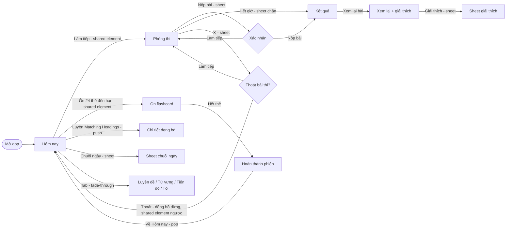

# Design direction and visual language

How the app looks, feels and moves. Every later design (DS-02…DS-06) and every UI task builds on this document; the
implementation of the tokens, components and motion foundation is AND-18.

**Mockups** (open in any modern browser; each has light/dark, phone/desktop and Reduce Motion switches):

| File | Shows |
| --- | --- |
| [`mockups/style-tile.html`](mockups/style-tile.html) | Type, colour, shape, depth, icons, illustration and the spring tokens side by side |
| [`mockups/components.html`](mockups/components.html) | Every `Lp…` component in every state, light and dark, interactive |
| [`mockups/home.html`](mockups/home.html) | "Hôm nay" home: all states, tab fade-through, push/pop, sheet, card → test room shared element |
| [`mockups/test-room.html`](mockups/test-room.html) | Reading test room: exam, time warning, submit sheet, result, review with explanations |
| [`mockups/flashcard.html`](mockups/flashcard.html) | Flashcard review: flip, swipe, rating, undo, session done, nothing due |

Mockups are self-contained HTML (inline CSS/JS, fonts from Google Fonts only), use the token values proposed below and
compute their spring curves from the spring tokens, so what you see is what AND-18 implements. The toolbar of each
mockup switches theme (light, dark, both), frame (phone 390 × 844, desktop 1280 × 800, both), screen state and Reduce
Motion, replays the transitions, and logs every haptic the interaction would fire.

## 1. The job

One Vietnamese learner prepares for IELTS every day on four devices.

| Moment | Device | Needs |
| --- | --- | --- |
| Morning commute, 10 minutes | Phone, one hand, noisy | Open → see today's plan → review due flashcards or a dictation clip |
| Lunch break, 20 minutes | Phone | Continue a Reading passage where it stopped |
| Evening, 60 minutes | Desktop or Mac, keyboard | Full test under exam conditions, then a careful review |
| Weekend | Any | See progress, weakest question type, plan next week |

User stories that drive this direction:

- As a learner I open the app and know within two seconds what to do now.
- As a test taker I feel the calm, familiar layout of IELTS on computer, with nothing that distracts me.
- As a reviewer I understand why an answer is wrong and save the words that tripped me up.
- As a daily learner I see my streak and weekly goal grow, without being shamed when I miss a day.
- As a keyboard user on desktop I can do everything without the mouse.
- As a user with Reduce Motion, large text or colour blindness I get the same information and comfort.

## 2. References — what to borrow, what to avoid

Patterns only; no visuals or assets are copied.

| Reference | Borrow | Avoid |
| --- | --- | --- |
| [Apple HIG](https://developer.apple.com/design/human-interface-guidelines/) — [typography](https://developer.apple.com/design/human-interface-guidelines/typography), [motion](https://developer.apple.com/design/human-interface-guidelines/motion), [materials](https://developer.apple.com/design/human-interface-guidelines/materials) | Large titles, inset grouped lists, translucent bars, springs, Dynamic Type thinking | Copying SF-only details on Android |
| [Material 3 motion](https://m3.material.io/styles/motion/overview) and [transitions](https://m3.material.io/styles/motion/transitions/transition-patterns) | Fade-through between tabs, container transform, predictive back | Heavy tonal elevation and FAB-centric layouts |
| [WCAG 2.2](https://www.w3.org/TR/WCAG22/) | AA contrast, 2.4.11 focus not obscured, 2.5.8 target size, 2.3.3 animation from interactions | — |
| [IELTS on computer](https://ielts.org/take-a-test/test-types/ielts-on-computer) (British Council / IDP familiarisation tests) | Passage left, questions right, timer top, question navigator bottom, highlight and notes | Its dated chrome and tiny type |
| Apple Fitness / Activity | Rings that fill, quiet celebration, weekly summary | Competitive badges and leaderboards |
| Apple Books, Apple Podcasts | Reading typography and measure, the mini player, scrubbing | — |
| [Quizlet](https://quizlet.com), [Anki](https://apps.ankiweb.net) (FSRS) | Card flip, rating buttons with next interval, swipe to rate | Anki's dense settings, Quizlet's ads and noise |
| Prep, Study4 | Dictation and review flows familiar to Vietnamese learners | Crowded dashboards, banner promos, red everywhere |

## 3. Principles and personality

**Personality: a friendly coach in a calm exam room.** When learning, the app is warm, encouraging and generous with
help. When testing, it steps back: quiet chrome, exam-faithful layout, no feedback until you submit.

1. **One thing to do now.** Each screen has one primary action, a large title and generous space. Remove what does not
   help the learner decide or act.
2. **Content is the interface.** Passages, transcripts and words get the best typography; chrome recedes into
   translucent bars and neutral surfaces.
3. **Encourage, never shame.** Mistakes are framed as learning, missed days do not reset to a red zero, celebration is a
   ring that fills and a soft haptic, never a pop-up.
4. **Physical and fluid.** Everything moves with springs, follows the finger and can be interrupted. Motion explains
   where things come from and go to; it never decorates.
5. **Same everywhere, native everywhere.** Same tokens, names and behaviour on Android, desktop, iPhone and Mac;
   platform conventions for back, sheets, keyboard and hover.
6. **Accessible by default.** AA contrast, 200 % text, labels, 48 dp targets, full keyboard, never colour alone,
   Reduce Motion fallbacks for every animation.

**Brand idea — "mực tím" (purple ink).** Vietnamese students grow up writing with purple ink. Our brand accent is a
confident indigo-violet ink on calm paper-white (or night-black) surfaces; a lotus pink is the warm accent for streaks
and celebration. Green-teal and vermilion are reserved for answers.

## 4. Voice and tone (Vietnamese copy)

- Address the learner as **"bạn"**; the app does not refer to itself ("mình", "chúng tôi" are avoided).
- Short, concrete, active sentences. Lead with the outcome: "Còn 2 buổi nữa là đạt mục tiêu tuần".
- Keep IELTS terms in English where learners know them (Reading, Listening, Band, Passage, TRUE / FALSE / NOT GIVEN,
  Matching Headings); everything else in natural Vietnamese with full diacritics.
- At most one exclamation mark per screen, only for real achievements. No emoji in UI copy (icons do that job).
- Sentence case everywhere ("Làm tiếp", not "LÀM TIẾP"); numbers as digits; time as "34 phút", "7:00 sáng mai".
- Errors say what happened and what to do, never blame: "Chưa tải được…" + one action.
- In exam mode copy is neutral and minimal — like an invigilator, not a coach.

| Situation | Do | Don't |
| --- | --- | --- |
| Wrong answer (review) | "Câu này hay bẫy ở chữ *however* — đáp án nằm ở câu sau." | "Sai rồi! Bạn cần cố gắng hơn." |
| Missed a day | "Chào bạn quay lại. Làm 5 phút để giữ nhịp nhé." | "Bạn đã mất chuỗi 12 ngày!" |
| Network error | "Chưa tải được kế hoạch hôm nay. Kiểm tra kết nối rồi thử lại nhé." | "Lỗi 503: Service Unavailable" |
| Offline | "Đang ngoại tuyến · Bài làm vẫn được lưu và sẽ đồng bộ khi có mạng." | "Không có kết nối Internet!!!" |
| Submit confirmation | "Bạn còn 3 câu chưa trả lời. Sau khi nộp sẽ không sửa được." | "Bạn có chắc chắn muốn nộp không?" |
| Goal reached | "Đạt mục tiêu tuần! 6/6 buổi." | "🎉🎉 Tuyệt vời quá!!! 🎉🎉" |
| Empty vocabulary | "Chạm vào một từ trong bài đọc để lưu vào đây." | "Không có dữ liệu." |
| Button | "Làm tiếp", "Nộp bài", "Xem lại bài" | "OK", "Tiếp tục thực hiện", "Submit" |
| Time warning (exam) | "Còn 5 phút" | "Nhanh lên! Sắp hết giờ!" |

## 5. Visual language

### 5.1 Typography

**Be Vietnam Pro** ([Google Fonts](https://fonts.google.com/specimen/Be+Vietnam+Pro),
[source](https://github.com/bettergui/BeVietnamPro)) — SIL Open Font License 1.1, designed in Vietnam for Vietnamese,
complete diacritic coverage including stacked marks (Ấ, Ậ, Ữ, Ỗ), weights 100–900 with italics, and tabular figures.
It is friendly and geometric without being childish and reads well at 17–18 px.

- One family on every platform, bundled with the app (Compose resources, app bundle on Apple), weights 400/500/600/700.
  SF Pro on Apple was considered and rejected: one family keeps screenshots, line breaks and brand identical everywhere.
- Vietnamese diacritics stack above the cap height, so every style keeps a line height of at least 1.3 × size and
  headings never use negative line spacing.
- Timer, scores, counters and question numbers use tabular figures (`tnum`) so digits do not jitter.
- All sizes scale with the system text size (sp in Compose, `relativeTo:` Dynamic Type styles in SwiftUI) up to 200 %;
  layouts reflow rather than truncate.

Apple-like scale (px = dp/sp = pt):

| Style | Size / line | Weight | Tracking | Use | Material slot |
| --- | --- | --- | --- | --- | --- |
| `display` | 56 / 64 | 700 | −0.5 | Band score, big numbers (tabular) | `displayLarge`, `displayMedium` |
| `largeTitle` | 32 / 40 | 700 | −0.4 | Screen title (collapses to `headline` in the bar) | `displaySmall`, `headlineLarge` |
| `title1` | 26 / 34 | 700 | −0.3 | Result headings, empty-state titles | `headlineMedium` |
| `title2` | 22 / 30 | 600 | −0.2 | Card titles, sheet titles, flashcard word (phone) | `headlineSmall`, `titleLarge` |
| `title3` | 19 / 26 | 600 | −0.1 | Section titles on desktop, question group headers | — |
| `headline` | 17 / 24 | 600 | 0 | Row titles, buttons, top-bar title | `titleMedium` |
| `body` | 17 / 26 | 400 | 0 | Default text, options, explanations | `bodyLarge` |
| `reading` | 18 / 30 | 400 | 0 | Passages, transcripts, example sentences | — |
| `callout` | 16 / 24 | 400 | 0 | Secondary paragraphs, card supporting text | — |
| `subheadline` | 15 / 22 | 400 | 0 | Row subtitles, metadata | `bodyMedium` |
| `label` | 15 / 20 | 600 | 0 | Chips, segmented control, tabs, small buttons | `titleSmall`, `labelLarge` |
| `footnote` | 13 / 18 | 400 | 0 | Hints, word counters, timestamps | `bodySmall` |
| `caption` | 12 / 16 | 500 | 0.2 | Tab-bar labels, tags, axis labels | `labelMedium` |
| `caption2` | 11 / 14 | 500 | 0.3 | Navigator numbers on phone, badges | `labelSmall` |

### 5.2 Colour

Calm cool-neutral surfaces, one brand ink, semantic colours tuned for colour blindness. Tones follow the same
CIELAB-lightness logic as today (tone 40 for light-mode fills, 80 for dark-mode fills, 90/30 for containers, 10/20 for
text on them), so contrast is predictable. Dark mode is designed: near-black backgrounds like iOS, cards lifted by
lightness instead of shadow, lighter tones for every accent.

| Role | Palette | Light | Dark | Use |
| --- | --- | --- | --- | --- |
| Primary (brand) | `indigo` "mực tím" | `#4B44C8` | `#BDB8FF` | Primary buttons, selection, links, focus ring, current tab |
| Secondary | `slate` | `#515771` | `#BCC2DE` | Quiet controls, secondary chips, tonal buttons |
| Tertiary | `lotus` | `#A3306B` | `#FFB0D2` | Streak, celebration, weekly ring |
| Correct (success) | `jade` | `#006B5E` | `#5ADACB` | Correct answers, done states |
| Wrong (error) | `vermilion` | `#A52E17` | `#FF8E6B` | Wrong answers, destructive actions, form errors |
| Warning | `amber` | `#844F00` | `#FFB960` | Time running out, word limit exceeded |
| Info | `sky` | `#005E9F` | `#A2C9FF` | Tips, offline banner, "did you know" |
| Background / surface | `neutral` | `#F4F4F7` | `#0B0B0E` | Screen background (grouped style) |
| Card | `neutral` | `#FFFFFF` | `#1B1B20` | Cards, grouped list sections, sheets |
| On surface | `neutral` | `#18181D` | `#E1E1E7` | Primary text |
| On surface variant | `neutralVariant` | `#55555F` | `#B4B4BF` | Secondary text, icons |
| Outline / outline variant | `neutralVariant` | `#81818C` / `#D3D3DA` | `#8A8A96` / `#3A3A42` | Field borders / hairline separators |

**Contrast** (checked with `design/lib/contrast.mjs` against every pair `test/tokens.test.mjs` checks, plus `card`; no
pair is below 4.5:1):

| Pair | Light | Dark |
| --- | --- | --- |
| `onPrimary` on `primary` | 7.1:1 | 7.4:1 |
| `onPrimaryContainer` on `primaryContainer` | 13.2:1 | 8.1:1 |
| `onSuccess` on `success` / `onError` on `error` | 6.4 / 7.0:1 | 7.8 / 5.8:1 |
| `onWarning` on `warning` / `onInfo` on `info` | 6.8 / 6.8:1 | 7.8 / 7.7:1 |
| `onSurface` on `surface` / on `card` | 16.1 / 17.7:1 | 15.1 / 13.2:1 |
| `onSurfaceVariant` on `surface` | 6.7:1 | 9.6:1 |
| `primary` on `surface` / on `card` | 6.5 / 7.1:1 | 10.7 / 9.4:1 |
| `correct` / `wrong` on `surface` | 5.9 / 6.4:1 | 11.5 / 8.7:1 |
| `correct` on `successContainer` / `wrong` on `errorContainer` | 5.2 / 5.4:1 | 5.5 / 4.6:1 |
| lowest accent on any surface level (incl. `surfaceDim`) | 4.58:1 (`correct`) | 5.82:1 (`wrong`) |
| `outline` on `surface` / on `card` | 3.5 / 3.9:1 | 5.8 / 5.0:1 |

**Colour-blind check.** Correct and wrong were moved from green/red to **jade (blue-green)** and **vermilion
(orange-red)** so they separate on the blue–yellow axis that protan and deutan vision keep. ΔE (CIELAB) between them
after Machado-2009 simulation:

| Mode | Normal | Protanopia | Deuteranopia | Tritanopia |
| --- | --- | --- | --- | --- |
| Light, old green/red (`#016E2A` / `#BF0125`) | 108 | 19 | 18 | 112 |
| Light, new jade/vermilion | 88 | 31 | 47 | 98 |
| Dark, old green/red (`#7CDB89` / `#FFB4AB`) | 73 | 28 | 11 | 67 |
| Dark, new jade/vermilion | 89 | 33 | 48 | 102 |

Colour is still never alone: correct shows a ✓ icon and "Đúng", wrong a ✗ icon and "Sai — đáp án: …", warning a
triangle icon, info an "i" icon; chips also change fill vs outline. Warning and wrong are close for deutan vision
(ΔE 3), which is acceptable because they never appear on the same element and always carry different icons.

### 5.3 Spacing and layout

- 4-pt grid; existing scale unchanged: `xs` 4, `sm` 8, `md` 12, `lg` 16, `xl` 24, `xxl` 32, `xxxl` 48.
- Screen margins: compact (< 600 dp) 20, medium (600–839) 24, expanded (≥ 840) 32.
- Expanded layout: sidebar 248, content max 1080 centred, 12 columns with 24 gutters. Reading text max 680 px
  (≈ 70 characters of `reading`).
- Vertical rhythm: 8 between related items, 24 between groups, 32 before a new section title.
- Minimum target 48 × 48 dp on every platform, including icon buttons (icon 24, padding to 48). Controls that look
  smaller (a 32-high text button in a section header, a 40-high chip) keep their visual size and get an invisible hit
  area that extends to 48. The one exception is the
  test-room question navigator: 40 × 40 on phone and 36 × 36 on desktop (pointer), spaced 8 apart, so 13 questions fit
  in one row like the real exam; this still exceeds WCAG 2.5.8 (24 × 24).
- Grouped inset lists (iOS Settings style): rows 56 high (64 with a subtitle), 16 inner padding, hairline separators
  inset to the text.

### 5.4 Shape

Soft, continuous-looking corners; nested corners shrink by the padding (outer 20, padding 8 → inner 12).

| Token | Value | Use |
| --- | --- | --- |
| `radius.xs` | 6 | Tags, navigator squares, highlights |
| `radius.sm` | 10 | Chips, text fields, small buttons, segmented control segments |
| `radius.md` | 14 | Buttons, list sections on phone, option rows |
| `radius.lg` | 20 | Cards, dialogs |
| `radius.xl` | 28 | Sheets (top corners), flashcard, phone hero cards |
| `radius.full` | 999 | Pills, avatar, progress tracks, streak badge |

SwiftUI uses `.continuous` corner style; Compose uses `RoundedCornerShape` (no squircle in Material).

### 5.5 Elevation and translucency

Depth comes from surface lightness first, shadow second.

| Token | Light | Dark | Use |
| --- | --- | --- | --- |
| `shadow.card` | `0 1 2 #000/4 %`, `0 4 16 #000/6 %` | none (card colour lifts) | Cards on the grouped background |
| `shadow.raised` | `0 2 6 #000/6 %`, `0 12 32 #000/10 %` | `0 12 32 #000/40 %` | Flashcard, dragged items, menus |
| `shadow.sheet` | `0 −4 24 #000/8 %` | none | Bottom sheets |
| `opacity.bar` | 78 % of `surface` + 24 px blur + 180 % saturation | 72 % of `surface` | Top bar after scroll, bottom bar, test-room toolbar |
| `opacity.scrim` | 32 % black | 48 % black | Behind sheets and dialogs |
| `opacity.disabled` | 38 % | 38 % | Disabled content |
| `opacity.hover` / `.pressed` / `.focus` | 8 / 12 / 12 % of the content colour | same | State layers |
| `opacity.highlight` | 70 % of `warningContainer` | same | Learner highlights in passages |

**Nesting and state rule.** Screens sit on `surface`; cards, sheets and grouped lists use `card`; anything nested
inside a card (timer pill, tag, text field, quote, segmented track, question number) uses `surfaceContainerHigh` in both
modes, so nothing disappears in dark mode where `card` and `surfaceContainer` share a tone. Hover and pressed never
swap the surface colour; they add an `onSurface` state layer at `opacity.hover` / `opacity.pressed` over whatever the
element sits on. The segmented-control indicator is `surfaceBright` with `shadow.card` on the `surfaceContainerHigh`
track.

Translucent bars use a real blur where the platform has it (`Material.bar` on Apple, `Modifier.hazeEffect` or
`RenderEffect` on Android 12+, desktop); elsewhere they fall back to the opaque `surface`. Bars are transparent at the
top of a scroll and become translucent with a hairline once content scrolls beneath (cross-fade, `duration.short`).

### 5.6 Icons

- **Material Symbols Rounded** ([Apache 2.0](https://github.com/google/material-design-icons)), weight 400, grade 0,
  optical size 24, outlined by default and filled for the selected tab or an active toggle. Used on Android and desktop
  and in the mockups.
- **SF Symbols** on iOS and macOS (Apple licence, Apple platforms only), weight regular, same meaning per icon.
- Sizes 20 (inline with text), 24 (default), 28 (tab bar on phone). Icons inherit the text colour of their role.

| Meaning | Material Symbols Rounded | SF Symbols |
| --- | --- | --- |
| Hôm nay | `wb_sunny` | `sun.max` |
| Luyện đề | `menu_book` | `book` |
| Từ vựng | `style` | `rectangle.stack` |
| Tiến độ | `monitoring` | `chart.line.uptrend.xyaxis` |
| Tôi | `person` | `person.crop.circle` |
| Correct / wrong | `check_circle` / `cancel` | `checkmark.circle.fill` / `xmark.circle.fill` |
| Warning / info | `warning` / `info` | `exclamationmark.triangle.fill` / `info.circle.fill` |
| Streak | `local_fire_department` | `flame.fill` |
| Timer / flag | `timer` / `flag` | `timer` / `flag` |
| Highlight / note | `ink_highlighter` / `sticky_note_2` | `highlighter` / `note.text` |
| Audio / play | `volume_up` / `play_arrow` | `speaker.wave.2` / `play.fill` |
| Undo / close / back | `undo` / `close` / `arrow_back_ios_new` | `arrow.uturn.backward` / `xmark` / `chevron.backward` |

### 5.7 Illustration

Used only for empty states, onboarding and the session-done moment, never as decoration on working screens.

- Flat geometric shapes with soft rounded corners, two brand tones (`primaryContainer` + `primary`) plus one accent
  (`tertiaryContainer`), 2 px rounded strokes in `onSurface` at 70 %; no faces, no gradients, no text inside.
- Subjects from the study world: an open book, a paper plane, a stack of cards, a sunrise over a notebook.
- 120 × 120 on phone, 160 × 160 on desktop; drawn as vectors (SVG → Compose `ImageVector`, SF Symbol-style asset on
  Apple) so they recolour for dark mode through tokens.
- The mockups contain the four original illustrations in this style.

## 6. Motion

### 6.1 Tokens

Springs are defined by **response** (time to reach the target, like SwiftUI) and **damping ratio**. Compose uses
`spring(dampingRatio, stiffness)` with `stiffness = (2π / response)²` for mass 1; SwiftUI uses
`.spring(response:dampingFraction:)`; CSS uses `linear()` easing sampled from the same equation (see mockups).

| Token | Response | Damping | Compose stiffness | Use |
| --- | --- | --- | --- | --- |
| `spring.snappy` | 0.30 s | 0.88 | 439 | Selection, toggles, segmented indicator, chips, button press |
| `spring.smooth` | 0.40 s | 1.00 | 247 | Push/pop, sheets, shared elements, layout changes (default) |
| `spring.bouncy` | 0.45 s | 0.72 | 195 | Correct reveal, card settling after swipe, streak flame |
| `spring.gentle` | 0.60 s | 1.00 | 110 | Ring and bar fills, number roll, large content reveals |

| Token | Value | Use |
| --- | --- | --- |
| `duration.instant` | 100 ms | Press feedback, hover layers |
| `duration.short` | 150 ms | Cross-fades, Reduce Motion replacement for every movement |
| `duration.medium` | 250 ms | Fade-through (90 out + 160 in), colour changes |
| `duration.long` | 400 ms | Skeleton shimmer step, timer warning pulse half-cycle |
| `duration.extraLong` | 700 ms | Number roll, ring fill when a spring is not available |
| `easing.standard` | `cubic-bezier(0.2, 0, 0, 1)` | Non-spring tweens |
| `easing.decelerate` | `cubic-bezier(0.05, 0.7, 0.1, 1)` | Elements entering |
| `easing.accelerate` | `cubic-bezier(0.3, 0, 0.8, 0.15)` | Elements leaving |
| `stagger.list` | 30 ms per item, max 8 items | Lists and cards appearing on first load |

Rules: only transform and opacity animate (no layout in animation); every animation is interruptible and retargets from
its current value; gesture-driven motion follows the finger 1:1 and hands its velocity to the spring on release.

### 6.2 Screen transitions

| Pattern | When | Animation | Token | Reduce Motion |
| --- | --- | --- | --- | --- |
| Push / pop | Drill into a detail (row → detail) | Incoming slides in from the trailing edge (100 % → 0); outgoing moves −30 % with an 8 % scrim (parallax); pop reverses | `spring.smooth` | Cross-fade `duration.short` |
| Predictive back (Android) / swipe back (iOS) | Back gesture | Current screen follows the finger: scale 1 → 0.92, corner radius 0 → `radius.xl`, previous screen revealed under it; release commits or springs back | finger, then `spring.smooth` | Cross-fade on commit |
| Tab fade-through | Switch top-level tab | Outgoing fades out 90 ms (`easing.accelerate`); incoming fades in 160 ms from scale 0.98 (`easing.decelerate`); each tab keeps its scroll position | `duration.medium` | Cross-fade `duration.short` |
| Sheet | Explanations, confirmations, word save | Phone: rises from the bottom with scrim fade, drag handle, swipe down to dismiss with velocity; desktop: centred dialog, fade + scale 0.96 → 1 | `spring.smooth` | Fade `duration.short` |
| Shared element (container transform) | Continue card → test room, "Ôn 24 thẻ đến hạn" row → review session, word → flashcard, band chip → feedback | Source bounds and corners morph into the destination; content cross-fades at 30 %–70 % of the progress; closing reverses into the source | `spring.smooth` | Cross-fade `duration.short` |
| Content change | Loading → content, phone passage ↔ questions | Skeleton cross-fades to content; segment content slides 24 px in the direction of the segment | `spring.snappy` | Cross-fade |

Sheets and dialogs (`LpSheet`) are fully keyboard and screen-reader operable: on open, focus moves to the sheet title,
or to the safe action for confirmations ("Làm tiếp"); Tab and Shift+Tab are trapped inside; Esc, Android back and swipe
down dismiss; on close, focus returns to the element that opened the sheet; the title is announced as the dialog name.
Blocking sheets ("Hết giờ") have no handle, ignore Esc, scrim taps and drags, and offer exactly one action.

Compose: Navigation 3 `transitionSpec` / `popTransitionSpec` / `predictivePopTransitionSpec`, `SharedTransitionLayout`
at the app root, `AnimatedContent`, `animateContentSize`. SwiftUI: `NavigationStack` push, `.navigationTransition(.zoom)`
with `matchedTransitionSource`, `matchedGeometryEffect`, `.presentationDetents` sheets, `withAnimation(.spring…)`.

### 6.3 Micro-interactions

| Element | Trigger | Animation | Token | Reduce Motion |
| --- | --- | --- | --- | --- |
| Button press | Pointer down / up | Scale 0.97 + pressed layer; release springs back | `spring.snappy` | Pressed layer only |
| Answer chip / option row | Select | Fill and border cross-fade, scale 0.96 → 1, radio dot grows from 0 | `spring.snappy` | Colour change only |
| Correct reveal (review) | Opening a reviewed question | Container colour fades in, ✓ pops from scale 0.6 with slight overshoot | `spring.bouncy` | Static ✓ |
| Wrong reveal | Same | Container fades in, ✗ appears without bounce (no shake: no punishment) | `spring.smooth` | Static ✗ |
| Flashcard flip | Tap / Space | 3D rotateY 0 → 180° around the centre, 1000 px perspective, back face hidden | `spring.smooth` | Cross-fade faces `duration.short` |
| Flashcard swipe | Drag | Follows the finger, rotates up to ±8°, rating hint fades in past 30 % of width; release past threshold flies out with velocity, next card scales 0.96 → 1. Hints use the rating colours, never the answer colours: "Quên" `secondaryContainer` + replay icon, "Được" `primaryContainer` + check | finger → `spring.bouncy` | Card cross-fades out and in |
| Progress ring / bar | Value change | Sweep fills from the old value | `spring.gentle` | Jump to value |
| Number roll | Score, streak, counters | Digits roll vertically, tabular figures | `spring.gentle` | Instant value |
| Timer warning | 5:00 and 1:00 left | Timer pill turns `warningContainer`; one soft pulse (scale 1 → 1.04 → 1) at each threshold, then still | `duration.long` | Colour change only |
| Segmented control | Select segment | Indicator slides under the selected segment | `spring.snappy` | Indicator jumps |
| Flag question | Toggle | Flag icon fills and tilts 12° then settles | `spring.bouncy` | Fill only |
| Skeleton | Loading > 300 ms | Shimmer sweeps every 1.2 s; skeletons appear only after 300 ms to avoid flashes | `duration.long` | Static grey blocks |
| Large title | Scroll | Large title collapses into the bar title; bar becomes translucent | scroll-linked | Same (scroll-linked) |
| Snackbar (undo) | After rating or deleting | Rises 16 px + fade; auto-hides after 4 s | `spring.smooth` | Fade |
| List first load | Screen appears | Items rise 12 px + fade, staggered | `spring.smooth`, `stagger.list` | Fade all at once |

### 6.4 Haptics

Key moments only; never on wrong answers, never on desktop.

| Moment | Android (`HapticFeedbackConstants`) | Apple (`sensoryFeedback`) |
| --- | --- | --- |
| Select an answer, tab, segment | `CLOCK_TICK` | `.selection` |
| Open a test or a review session (container transform) | `CONTEXT_CLICK` | `.impact(weight: .light)` |
| Swipe passes the rating threshold | `GESTURE_THRESHOLD_ACTIVATE` | `.impact(flexibility: .soft)` |
| Rate a flashcard | `SEGMENT_TICK` | `.impact(weight: .light)` |
| Submit a test | `CONFIRM` | `.impact(weight: .medium)` |
| Three correct in a row (review), session done, goal reached | `CONFIRM` | `.success` |
| 5:00 / 1:00 left, time up | `LONG_PRESS` | `.warning` |
| Undo | `VIRTUAL_KEY` | `.impact(weight: .light)` |

Haptics respect the system setting and an in-app switch ("Rung phản hồi").

### 6.5 Reduce Motion

Respect `Settings.Global.ANIMATOR_DURATION_SCALE == 0` / "Remove animations" on Android, `accessibilityReduceMotion`
on Apple, `prefers-reduced-motion` on desktop and web, plus the in-app switch "Giảm chuyển động" (AND-18). When on:
every movement (slide, scale, rotate, roll, parallax, shimmer, pulse) becomes a cross-fade of `duration.short` or an
instant change; colour and opacity changes stay; scroll-linked effects and finger-driven drags stay because the user
drives them; indeterminate spinners keep turning because they carry the "still working" meaning.

## 7. Sample screens

Tab names follow DS-02's proposal (Hôm nay, Luyện đề, Từ vựng, Tiến độ, Tôi); DS-02 owns the final IA.



### 7.1 Hôm nay (home)

**Purpose:** what to do now and how I am improving. Primary action: **Làm tiếp** (continue the last test), or
**Làm bài đầu tiên** for a new learner.

| Size class | Layout |
| --- | --- |
| Phone (compact) | Date caption + large title "Hôm nay", streak pill top-right. Continue card (hero, shared-element source) → weekly goal card with ring → "Kế hoạch hôm nay" inset list → "Cần luyện thêm" weakness tile. Translucent bottom bar with 5 tabs. |
| Tablet / foldable (medium) | Navigation rail; two columns: continue + plan left, goal + weakness right. |
| Desktop (expanded) | Sidebar 248 (app name, 5 destinations, streak at the bottom); content max 1080, two columns 7/5. |

Components: `LpLargeTitleBar`, `LpStreakBadge`, `LpContinueCard` (new), `LpCard`, `LpProgressRing`, `LpSectionHeader`,
`LpListRow`, `LpStatTile`, `LpNavigationSuite`, `LpBanner`, `LpSkeleton`, `LpEmptyState`, `LpErrorState`,
`LpPrimaryButton`, `LpSheet`.

| State | What the learner sees | Copy |
| --- | --- | --- |
| Content | Full home | "Làm tiếp", "Còn 2 buổi nữa là đạt mục tiêu tuần", "Ôn 24 thẻ đến hạn", "Matching Headings · 58% đúng" |
| Loading (> 300 ms) | Skeletons in the shape of the cards | screen reader: "Đang tải kế hoạch hôm nay" |
| Empty (new learner) | Illustration + one action | "Chào bạn!" / "Làm một bài Reading 20 phút để biết bạn đang ở đâu." / "Làm bài đầu tiên" |
| Error | Error state in place of the content | "Chưa tải được kế hoạch hôm nay" / "Kiểm tra kết nối rồi thử lại nhé." / "Thử lại" |
| Offline | Cached content + info banner | "Đang ngoại tuyến · Bài làm vẫn được lưu và sẽ đồng bộ khi có mạng." |
| Goal reached | Ring full in `tertiary` with a check, one-time success haptic | "Đạt mục tiêu tuần!" / "6/6 buổi · tuần sau giữ nhịp này nhé" |

Accessibility: ring announces "Mục tiêu tuần: 4 trên 6 buổi"; streak pill "Chuỗi 12 ngày, mở chi tiết"; each plan row
is one focusable element with its duration; done rows announce "Đã xong". Keyboard (desktop): ⌘/Ctrl 1–5 switch
destinations, Enter on the continue card opens the test room, Tab order follows reading order.

Motion: first load stagger; ring and counts roll with `spring.gentle`; continue card → test room and "Ôn 24 thẻ đến
hạn" row → review session are container transforms (no intermediate screen); other plan rows push a detail; streak
pill → sheet; tabs fade-through.

### 7.2 Phòng thi Reading (test room)

**Purpose:** take a timed Reading test exactly like IELTS on computer. Primary action: answering; **Nộp bài** is
always available but visually secondary until time is nearly up.

| Size class | Layout |
| --- | --- |
| Phone | Compact bar: close, "Passage 2", timer pill. Segmented control "Bài đọc / Câu hỏi". One pane at a time; the question navigator is a horizontally scrolling strip above the home indicator with "Nộp bài". |
| Tablet landscape / desktop | Exam bar: test name left, timer centre, tools right (highlight, note, text size), "Nộp bài". Split view: passage left (max 680, `reading`), draggable divider, questions right. Navigator bar at the bottom: part tabs, the current part's squares expanded and the other parts collapsed to answered/total counters, previous / next. |

Components: `LpExamBar` (new), `LpTimerBar` (restyled as a pill), `LpSegmentedControl` (new), `LpAnswerChip`,
`LpOptionRow`, `LpGapField`, `LpQuestionNavigator` (new), `LpIconButton` (new), `LpSheet`, `LpBandBadge`,
`LpProgressRing`, `LpExplainSheet`, `LpBanner`, `LpSkeleton`, `LpErrorState`.

| State | What the learner sees | Copy |
| --- | --- | --- |
| In progress | Passage, questions, live timer | "Questions 14–19", "Do the following statements agree with the information given in Reading Passage 2?" (exam text stays English) |
| Time warning | Timer pill `warningContainer` at 5:00 and 1:00, one pulse + haptic | "Còn 5 phút" (screen reader announcement, once) |
| Submit sheet | Summary of unanswered and flagged questions | "Nộp bài?" / "Bạn còn 3 câu chưa trả lời. Sau khi nộp sẽ không sửa được." / "Nộp bài" · "Làm tiếp" |
| Time up | Blocking sheet at 00:00 (no handle, no Esc, one action), warning haptic; answers saved automatically | "Hết giờ" / "Bài làm đã được lưu. Các câu chưa trả lời được tính là bỏ trống." / "Xem kết quả" |
| Exit | ✕ opens a sheet and pauses the timer (`LpTimerBar` paused); "Làm tiếp" resumes, "Thoát" saves and returns home with the reverse container transform; the continue card shows the paused time | "Thoát bài thi?" / "Bài làm được lưu. Đồng hồ tạm dừng, bạn làm tiếp được từ Hôm nay." / "Làm tiếp" · "Thoát" |
| Result | Band rolls up, ring of correct answers, per-part breakdown | "Band 7.0", "30/40 câu đúng", "Xem lại bài" |
| Review | Chips show correct (✓ jade) / wrong (✗ vermilion + correct answer), "Giải thích" opens the explain sheet with evidence highlighted in the passage | "Sai — đáp án: NOT GIVEN", "Câu này hay bẫy ở…" |
| Loading | Passage and question skeletons | "Đang mở bài thi" |
| Error | Error state | "Không mở được bài thi" / "Bài làm của bạn không bị mất." / "Thử lại" |
| Offline | Small cloud-off icon in the exam bar (no banner in exam mode) | tooltip / label "Đang ngoại tuyến · Câu trả lời được lưu trên máy" |

Exam rules: no correct/wrong colour before submit; highlights use `warningContainer` at 70 % (yellow marker feel)
with a non-colour underline in high-contrast mode; flagged questions show a flag in the navigator.

Accessibility: navigator squares announce "Câu 18, đã trả lời, đã đánh dấu"; the "Câu hỏi" segment shows the number of
unanswered questions in this part and announces "Câu hỏi, còn 9 câu chưa trả lời"; timer is announced only at thresholds
(not every second); passage supports 200 % text by reflowing to the phone layout; the divider is keyboard adjustable.
Keyboard: ←/→ previous/next question, A–D choose option, T/F/N choose TRUE/FALSE/NOT GIVEN, M flag, ⌘/Ctrl+H highlight
selection, ⌘/Ctrl+= / − text size, ⌘/Ctrl+Enter submit.

Motion: card → room container transform; segmented content slide; chip selection; navigator jump scrolls the
question into view with `spring.smooth` and a 1 s `primaryContainer` flash; submit sheet; result push with band
number roll and ring fill (`spring.gentle`); correct/wrong reveal in review.

### 7.3 Ôn flashcard (review session)

**Purpose:** review due cards quickly and pleasantly. Primary action: flip, then rate.

| Size class | Layout |
| --- | --- |
| Phone | Bar: close, progress "19/24" with thin bar, undo. Card fills the width (margin 20, `radius.xl`), action area at the bottom within thumb reach. |
| Desktop | Focus mode without the sidebar: card 560 wide centred, action area below with key hints, shortcut legend at the bottom. |

Front: word (`largeTitle`), IPA, part of speech tag, audio button, source ("Cambridge 18 · Test 2").
Back: Vietnamese meaning, English definition, example sentence with the word highlighted, audio.
Ratings (FSRS) show the next interval: **Quên** (< 1 phút), **Khó** (6 phút), **Được** (1 ngày), **Dễ** (4 ngày).

Components: `LpFlashcard` (new), `LpRatingButton` (new), `LpProgressBar` (new), `LpIconButton`, `LpTag` (new),
`LpSnackbar` (new), `LpProgressRing`, `LpEmptyState`, `LpErrorState`, `LpSkeleton`.

| State | What the learner sees | Copy |
| --- | --- | --- |
| Front | Word side; the action area holds one primary "Lật thẻ" button (Space on desktop) | "Chạm để lật thẻ" (phone), "Nhấn Space hoặc bấm để lật thẻ" (desktop) |
| Back | Meaning side; the action area swaps to the four ratings (90 ms out, `spring.snappy` in) | "Quên", "Khó", "Được", "Dễ" with intervals |
| Swiping | Card tilts, hint label appears | Right: "Được", left: "Quên" |
| Undo | Snackbar after each rating | "Đã chấm “Được” · Hoàn tác" |
| Session done | Ring fills, one success haptic, summary | "Xong 24 thẻ hôm nay!" / "18 thẻ nhớ tốt · 6 thẻ cần ôn lại" / "Lần ôn tiếp: 12 thẻ, ngày mai" / "Về Hôm nay" |
| Nothing due | Illustration, next due time, secondary action | "Hôm nay bạn đã ôn hết thẻ" / "Thẻ tiếp theo đến hạn lúc 7:00 sáng mai." / "Học từ mới" |
| Loading | Card skeleton | "Đang chuẩn bị thẻ" |
| Error | Error state | "Chưa tải được bộ thẻ" / "Thử lại" |

Accessibility: the card is a button "Thẻ: meticulous. Chạm hai lần để lật" ("Nhấn Space để lật" on desktop); after flipping, focus moves to the meaning;
swipe is never required (buttons always there); custom accessibility actions "Quên/Khó/Được/Dễ" on the card; audio
buttons labelled "Nghe phát âm". Keyboard: Space flip, 1–4 rate, ⌘/Ctrl+Z undo, Esc close.

Motion: home "Ôn 24 thẻ đến hạn" row → card container transform; flip; swipe with finger-follow; next card scales in; undo returns
the card from the side it left; session done ring + number roll.

## 8. Token changes for `design/tokens/*.json`

AND-18 applies these exactly and regenerates Compose and Swift outputs.

### 8.1 `palette.json` — replace

```json
{
  "palette": {
    "$type": "color",
    "white": { "$value": "#FFFFFF" },
    "black": { "$value": "#000000" },
    "indigo":    { "10": { "$value": "#16105A" }, "20": { "$value": "#221A84" }, "30": { "$value": "#342CA6" }, "40": { "$value": "#4B44C8" }, "80": { "$value": "#BDB8FF" }, "90": { "$value": "#E4E2FF" } },
    "slate":     { "10": { "$value": "#151A2E" }, "20": { "$value": "#262C42" }, "30": { "$value": "#3C4259" }, "40": { "$value": "#515771" }, "80": { "$value": "#BCC2DE" }, "90": { "$value": "#DFE2F2" } },
    "lotus":     { "10": { "$value": "#3D0022" }, "20": { "$value": "#600038" }, "30": { "$value": "#841650" }, "40": { "$value": "#A3306B" }, "80": { "$value": "#FFB0D2" }, "90": { "$value": "#FFD8E7" } },
    "jade":      { "10": { "$value": "#00201B" }, "20": { "$value": "#003730" }, "30": { "$value": "#005046" }, "40": { "$value": "#006B5E" }, "80": { "$value": "#5ADACB" }, "90": { "$value": "#C2F0E7" } },
    "vermilion": { "10": { "$value": "#3D0700" }, "20": { "$value": "#611300" }, "30": { "$value": "#7D1B06" }, "40": { "$value": "#A52E17" }, "80": { "$value": "#FF8E6B" }, "90": { "$value": "#FFDBD1" } },
    "amber":     { "10": { "$value": "#2B1700" }, "20": { "$value": "#482900" }, "30": { "$value": "#673D00" }, "40": { "$value": "#844F00" }, "80": { "$value": "#FFB960" }, "90": { "$value": "#FFDDB5" } },
    "sky":       { "10": { "$value": "#001C38" }, "20": { "$value": "#003259" }, "30": { "$value": "#00487D" }, "40": { "$value": "#005E9F" }, "80": { "$value": "#A2C9FF" }, "90": { "$value": "#D3E4FF" } },
    "neutral": {
      "4": { "$value": "#0B0B0E" }, "8": { "$value": "#141418" }, "10": { "$value": "#18181D" }, "12": { "$value": "#1B1B20" },
      "17": { "$value": "#25252B" }, "20": { "$value": "#2C2C33" }, "22": { "$value": "#303037" },
      "87": { "$value": "#D9D9E0" }, "90": { "$value": "#E1E1E7" }, "92": { "$value": "#E7E7EC" }, "94": { "$value": "#EDEDF1" },
      "95": { "$value": "#F0F0F4" }, "96": { "$value": "#F4F4F7" }, "98": { "$value": "#FAFAFC" }
    },
    "neutralVariant": {
      "26": { "$value": "#3A3A42" }, "30": { "$value": "#55555F" }, "50": { "$value": "#81818C" },
      "60": { "$value": "#8A8A96" }, "75": { "$value": "#B4B4BF" }, "85": { "$value": "#D3D3DA" }
    }
  }
}
```

### 8.2 `color-light.json` and `color-dark.json` — remap

Accent roles follow one rule per mode. For role → hue `primary → indigo`, `secondary → slate`, `tertiary → lotus`,
`error → vermilion`, `success → jade`, `warning → amber`, **new** `info → sky`:

| Token | Light | Dark |
| --- | --- | --- |
| `<role>` | `{hue}.40` | `{hue}.80` |
| `on<Role>` | `white` | `{hue}.20` |
| `<role>Container` | `{hue}.90` | `{hue}.30` |
| `on<Role>Container` | `{hue}.10` | `{hue}.90` |
| `<role>Fixed` / `<role>FixedDim` (primary, secondary, tertiary) | `{hue}.90` / `{hue}.80` | same |
| `on<Role>Fixed` / `on<Role>FixedVariant` | `{hue}.10` / `{hue}.30` | same |

New tokens: `info`, `onInfo`, `infoContainer`, `onInfoContainer`, `card`. `correct` stays `{color.<mode>.success}`,
`wrong` stays `{color.<mode>.error}`. Neutral roles:

| Token | Light | Dark |
| --- | --- | --- |
| `background`, `surface` | `neutral.96` | `neutral.4` |
| `onBackground`, `onSurface` | `neutral.10` | `neutral.90` |
| `surfaceDim` | `neutral.87` | `neutral.4` |
| `surfaceBright` | `neutral.98` | `neutral.22` |
| `surfaceVariant` | `neutral.92` | `neutral.17` |
| `onSurfaceVariant` | `neutralVariant.30` | `neutralVariant.75` |
| `surfaceContainerLowest` | `white` | `black` |
| `surfaceContainerLow` | `neutral.98` | `neutral.8` |
| `surfaceContainer` | `neutral.94` | `neutral.12` |
| `surfaceContainerHigh` | `neutral.92` | `neutral.17` |
| `surfaceContainerHighest` | `neutral.90` | `neutral.22` |
| `card` (new) | `white` | `neutral.12` |
| `inverseSurface` | `neutral.20` | `neutral.90` |
| `inverseOnSurface` | `neutral.95` | `neutral.20` |
| `inversePrimary` | `indigo.80` | `indigo.40` |
| `outline` | `neutralVariant.50` | `neutralVariant.60` |
| `outlineVariant` | `neutralVariant.85` | `neutralVariant.26` |
| `scrim` | `black` | `black` |

`test/tokens.test.mjs` should add `info` to the foreground list, `['onInfo', 'info']`, `['onInfoContainer',
'infoContainer']` and `card` to the surface list; all pass with the values above.

### 8.3 `typography.json` — replace

`font.family.base` becomes `"Be Vietnam Pro"`; weights `regular` 400, `medium` 500, `semibold` 600, **new** `bold`
700. The 15 Material styles are replaced by the 14 styles of §5.1 (sizes, line heights, weights and letter spacing
exactly as in the table, e.g. `"headline": { "$value": { "fontFamily": "{font.family.base}", "fontWeight":
"{font.weight.semibold}", "fontSize": "17px", "lineHeight": "24px", "letterSpacing": "0px" } }`). `LpTheme` maps them
to the Material `Typography` slots listed in the table. `lib/values.mjs#requireSystemFont` changes to accept the
bundled family.

### 8.4 `radius.json`

`none` 0 unchanged, `xs` 4 → **6**, `sm` 8 → **10**, `md` 12 → **14**, `lg` 20, `xl` 28 unchanged, **new** `full` 999.

### 8.5 `spacing.json` and new `layout.json`

`spacing.json` unchanged. New `layout.json`:

```json
{
  "layout": {
    "$type": "dimension",
    "margin": { "compact": { "$value": "20px" }, "medium": { "$value": "24px" }, "expanded": { "$value": "32px" } },
    "sidebarWidth": { "$value": "248px" },
    "contentMaxWidth": { "$value": "1080px" },
    "readingMaxWidth": { "$value": "680px" },
    "gutter": { "$value": "24px" }
  }
}
```

### 8.6 `elevation.json` → `shadow.json`, new `opacity.json`

Replace `elevation.json` with `shadow.json` (W3C `shadow` type, arrays of layers; dark values from §5.5):

```json
{
  "shadow": {
    "$type": "shadow",
    "light": {
      "card":   { "$value": [ { "color": "#0000000A", "offsetX": "0px", "offsetY": "1px", "blur": "2px", "spread": "0px" }, { "color": "#0000000F", "offsetX": "0px", "offsetY": "4px", "blur": "16px", "spread": "0px" } ] },
      "raised": { "$value": [ { "color": "#0000000F", "offsetX": "0px", "offsetY": "2px", "blur": "6px", "spread": "0px" }, { "color": "#0000001A", "offsetX": "0px", "offsetY": "12px", "blur": "32px", "spread": "0px" } ] },
      "sheet":  { "$value": [ { "color": "#00000014", "offsetX": "0px", "offsetY": "-4px", "blur": "24px", "spread": "0px" } ] }
    },
    "dark": {
      "card":   { "$value": [] },
      "raised": { "$value": [ { "color": "#00000066", "offsetX": "0px", "offsetY": "12px", "blur": "32px", "spread": "0px" } ] },
      "sheet":  { "$value": [] }
    }
  }
}
```

New `opacity.json`: `bar.light` 0.78, `bar.dark` 0.72, `scrim.light` 0.32, `scrim.dark` 0.48, `disabled` 0.38,
`hover` 0.08, `pressed` 0.12, `focus` 0.12, `highlight` 0.70 (`$type: number`), plus `blur.bar` 24px.

### 8.7 `size.json` — change and add

Progress rings become a three-step scale used everywhere (home goal, result, session done):

| Token | Size / stroke | Use |
| --- | --- | --- |
| `progressRing.small` / `progressRingStroke.small` | 48 / 4 (unchanged) | Inline progress, spinner |
| `progressRing.medium` / `progressRingStroke.medium` (new) | 84 / 10 | Weekly goal |
| `progressRing.large` / `progressRingStroke.large` | 120 / 8 → **168 / 14** | Test result, session done |

Add `touchTarget` 48, `icon.small` 20, `icon.medium` 24, `icon.large` 28, `focusRing` 2 (and `border.focus` 2 in
`border.json`), `navigatorItem.compact` 40, `navigatorItem.expanded` 36, `flashcardMaxWidth` 560,
`illustration.compact` 120, `illustration.expanded` 160.

### 8.8 `motion.json` — replace

```json
{
  "motion": {
    "spring": {
      "$type": "spring",
      "snappy": { "$value": { "response": "300ms", "dampingRatio": 0.88 } },
      "smooth": { "$value": { "response": "400ms", "dampingRatio": 1.0 } },
      "bouncy": { "$value": { "response": "450ms", "dampingRatio": 0.72 } },
      "gentle": { "$value": { "response": "600ms", "dampingRatio": 1.0 } }
    },
    "duration": {
      "$type": "duration",
      "instant": { "$value": "100ms" },
      "short": { "$value": "150ms" },
      "medium": { "$value": "250ms" },
      "long": { "$value": "400ms" },
      "extraLong": { "$value": "700ms" }
    },
    "easing": {
      "$type": "cubicBezier",
      "standard": { "$value": [0.2, 0, 0, 1] },
      "decelerate": { "$value": [0.05, 0.7, 0.1, 1] },
      "accelerate": { "$value": [0.3, 0, 0.8, 0.15] }
    },
    "stagger": { "$type": "duration", "list": { "$value": "30ms" } }
  }
}
```

`spring` is a custom type: the Compose format emits `spring(dampingRatio, stiffness = (2π / response)²)`, the Swift
format `.spring(response:dampingFraction:)`.

## 9. Component inventory

All components are stateless, exist with the same name and parameters in Compose and SwiftUI, and have a preview per
state in light and dark, phone and desktop width. `components.html` shows each one.

### 9.1 Existing components to restyle

| Component | Changes | States |
| --- | --- | --- |
| `LpPrimaryButton` | Height 52 (phone) / 44 (desktop), `radius.md`, `headline`, press scale 0.97, optional leading icon, loading spinner replaces label | enabled, pressed, focused, disabled, loading |
| `LpSecondaryButton` | Tonal: `secondaryContainer` fill instead of outline; same sizes | enabled, pressed, focused, disabled |
| `LpTextButton` | `primary` text, `label`; visual height 32–48, hit area always 48 | enabled, pressed, disabled |
| `LpAnswerChip` | `radius.sm`, `label`, idle = `card` fill + 1 px `outline` border in both modes (the border keeps it visible on any surface); selected = `primaryContainer` fill + `primary` 2 px border; correct/wrong = container fill + ✓/✗ icon + label; missed = dashed `correct` border | idle, selected, correct, wrong, missed, disabled (exam ended) |
| `LpOptionRow` | Inset row 56 min, `card` + `outline` border, letter badge (A–D) instead of a radio, `radius.md`; correct/wrong add icon; missed = dashed `correct` border + "Đáp án đúng" | idle, selected, correct, wrong, missed |
| `LpGapField` | Filled field `surfaceContainerHigh` + `outline` border, height 48, `radius.sm`, counter in `footnote`; over limit → `warning` border + text, not `error` | empty, focused, within limit, over limit, no limit, correct, wrong |
| `LpTimerBar` | Becomes a pill on `surfaceContainerHigh`: timer icon + tabular `headline`; thin bar optional on desktop | normal, warning (≤ 5:00), critical (≤ 1:00), paused (pause icon) |
| `LpBandBadge` | `display` / `title2` numbers with tabular figures, `primaryContainer` circle, number roll | small, large, rolling |
| `LpTestCard` | `card` + `shadow.card`, `radius.lg`, progress bar for in-progress tests, shared-element source | not started, in progress, done (band shown), disabled (coming soon) |
| `LpProgressRing` | Round caps, track `surfaceContainerHigh`, fill `primary` or `tertiary` (goals), `spring.gentle`, sizes small/medium/large from §8.7 | indeterminate, small, medium, large, complete |
| `LpEmptyState` | Illustration slot (120/160), `title1`, `callout`, one action | title only, with message, with action, with illustration |
| `LpErrorState` | Icon in `errorContainer` circle, title, message, "Thử lại" | default, retrying |
| `LpExplainSheet` | `radius.xl` top, drag handle, evidence quote in `reading` with highlight, "Lưu từ" chips, detents medium/large | default, with evidence, with vocabulary |

### 9.2 New components

| Component | Purpose | States |
| --- | --- | --- |
| `LpLargeTitleBar` | Large title that collapses into a translucent top bar on scroll | expanded, collapsed |
| `LpNavigationSuite` | Bottom bar (phone), rail (medium), sidebar (expanded) with the same destinations | selected, unselected, hover, with badge, focused |
| `LpCard` | Grouped container on the background (`card`); children use `surfaceContainerHigh` | default, pressed (state layer, if clickable), focused |
| `LpContinueCard` | Hero card "Tiếp tục" with test name, part, progress and the primary action | in progress, almost done |
| `LpSectionHeader` | Section title with an optional trailing action | default, with action |
| `LpListRow` | Inset grouped row: leading icon tile, title, subtitle, trailing value / chevron / check | default, pressed, done, disabled |
| `LpStatTile` | Small metric with label and mini bar ("Matching Headings 58%") | improving, declining, unchanged |
| `LpStreakBadge` | Flame + day count pill, opens the streak sheet | active today, not yet today, frozen |
| `LpIconButton` | 48 target icon button with tooltip on desktop | default, pressed, selected (toggle), disabled |
| `LpSegmentedControl` | 2–4 segments with a sliding indicator: track `surfaceContainerHigh` (`radius.md`, 4 padding), indicator `surfaceBright` + `shadow.card` (`radius.sm`) | selected index, with counter |
| `LpExamBar` | Test-room toolbar: title, timer, tools, submit | normal, warning, offline, review (band instead of timer) |
| `LpQuestionNavigator` | Part tabs + numbered squares | per item: unanswered, answered, current, flagged, correct, wrong |
| `LpProgressBar` | Thin linear progress with rounded caps | determinate, complete |
| `LpTag` | Small label ("Mới", "adj", "Đang làm") | neutral, primary, success, warning |
| `LpBanner` | Inline message at the top of content | info, warning, offline, with action |
| `LpSnackbar` | Transient message with an optional action (undo) | default, with action |
| `LpSheet` | Bottom sheet (phone) / dialog (desktop) container with handle, title and actions; focus rules in §6.2 | phone sheet, desktop dialog, blocking (no handle, no dismiss) |
| `LpSkeleton` | Loading placeholder shapes (line, block, circle) | animated, static (Reduce Motion) |
| `LpFlashcard` | Two-faced card with flip and swipe | front, back, dragging left, dragging right, flying out |
| `LpRatingButton` | FSRS rating with label and interval; "Được" is the primary-filled one, the others tonal | again, hard, good, easy × enabled, pressed |

## 10. Accessibility checklist

- [x] All text/background pairs ≥ 4.5:1, UI boundaries ≥ 3:1 (§5.2), both modes.
- [x] Correct/wrong/warning/info never by colour alone; CVD-checked hues.
- [x] Type scales to 200 %; layouts reflow (test room switches to the phone layout).
- [x] Targets ≥ 48 dp; focus ring 2 px `primary` with 2 px offset, never hidden by bars (WCAG 2.4.11).
- [x] Every screen has screen-reader labels, announcements for timer thresholds and results.
- [x] Full keyboard use on desktop with listed shortcuts.
- [x] Reduce Motion fallback for every animation (§6.5); no flashing content.

## 11. Decisions and notes for implementation

- **Brand colour changes** from violet `#7543BA` to indigo ink `#4B44C8`; teal secondary becomes low-chroma slate so
  it never competes with the jade "correct" colour; rose tertiary becomes lotus.
- **Correct/wrong** move to jade/vermilion for colour-blind separation (§5.2).
- **Be Vietnam Pro** must be bundled (≈ 4 static weights, ~150 KB each as TTF); the token build check for
  `system-ui` is relaxed in AND-18. Verify its `tnum` feature in the bundled files; if a weight lacks it, use
  `font-variant-numeric` fallbacks only for the timer.
- **Shadows and translucency** need new Style Dictionary formats (shadow, opacity, spring) in AND-18.
- The Reading passage and questions in the mockups ("Ageing without decline") are original sample text written for
  this direction, not copied from Cambridge books; the book/test labels only show where real content will appear.
- Tab names in the mockups follow DS-02's proposal; the current app uses "Luyện tập" for the practice tab, DS-02
  decides.
