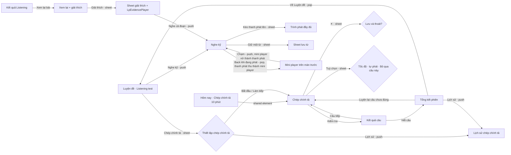

# Listening study: intensive listening and dictation

How the learner re-listens to a Listening test sentence by sentence and types what they hear. It builds on the
[design direction](../direction/README.md) (tokens, components, motion, voice). AND-13 implements intensive listening
and the player, AND-14 implements dictation.

**Goal:** re-listening and dictation feel as smooth as a great podcast player.

**Mockups** (open in any modern browser; each has light/dark, phone/desktop, screen state and Reduce Motion switches,
replays its transitions and logs every haptic):

| File | Shows |
| --- | --- |
| [`mockups/intensive-listening.html`](mockups/intensive-listening.html) | Nghe kỹ: synced karaoke transcript, sentence and section navigation, A–B loop, repeat, speed, hide transcript, translation, evidence playback, full player sheet, all states |
| [`mockups/dictation.html`](mockups/dictation.html) | Chép chính tả: setup and resume, typing with a working word checker, word-level feedback, hints, cloze mode, options and skip, Vietnamese-keyboard warning, session summary with confusable sounds, history, all states |
| [`mockups/player.html`](mockups/player.html) | Player components: `LpPlayButton`, `LpWaveform`, `LpPlayerBar`, `LpFullPlayer`, `LpMiniPlayer`, `LpEvidencePlayer` and friends in every state, plus the mini player ⇄ Nghe kỹ push with the bar as shared element and the review → evidence player → Nghe kỹ flow |

Audio in the mockups is simulated by a clock (no audio file is shipped); the transcript, questions and translations
are original sample text written for this design ("Riverside Community Garden"), not taken from any book.

## 1. The job

| Moment | Device | Needs |
| --- | --- | --- |
| After a Listening test, evening | Desktop, keyboard | Hear again exactly where a wrong answer was, slower, until the trap is clear |
| Commute, 10 minutes | Phone, one hand, earphones, noisy | One dictation section; replay a sentence without looking; resume later |
| Weekend deep practice | Desktop or Mac | A whole section with the transcript hidden, then shown, sentence by sentence with A–B loops |
| Any time | Any | Save words heard in context to flashcards, with the audio of the sentence |

User stories:

- As a learner who got question 14 wrong, I tap "Nghe lại đoạn này" and hear exactly the sentences with the answer,
  slowed down if I want, as many times as I need.
- As an intensive listener I move sentence by sentence, loop any range, change the speed and repeat each sentence N
  times, with the words lighting up as they are spoken.
- As a learner testing myself I hide the transcript, listen, and reveal one sentence at a time.
- As a dictation learner I hear a sentence, type it, and see word by word what I got right, wrong or missed, with the
  right words shown — kindly.
- As a keyboard user on desktop I never touch the mouse: play, replay, slow down, check and continue from the keys.
- As a learner on the bus I leave the screen and the audio keeps playing in a mini player and on the lock screen.
- As a screen-reader or Reduce Motion user I get the same information and control.

## 2. References — what to borrow, what to avoid

Patterns only; no screenshots or assets are copied.

| Reference | Borrow | Avoid |
| --- | --- | --- |
| [Apple Podcasts](https://www.apple.com/apple-podcasts/) (transcripts, mini player) | Time-synced transcript with the current sentence emphasised and tap-to-play, mini player that grows back into the docked player, ±seconds buttons | Hiding speed behind a menu; tiny scrub targets |
| [Apple Music](https://www.apple.com/apple-music/) (lyrics) | Past/current/upcoming lines in three tones, auto-scroll that pauses when the user scrolls and a pill to return | Large decorative blur backgrounds behind text |
| [HIG — Playing audio](https://developer.apple.com/design/human-interface-guidelines/playing-audio), [Now Playing](https://developer.apple.com/documentation/mediaplayer/mpnowplayinginfocenter) | Lock-screen and Control Center controls, interruptions (calls, other apps), AirPods remote commands | — |
| [Android media controls](https://developer.android.com/media/implement/surfaces/mobile) and [Material 3 sliders](https://m3.material.io/components/sliders/overview) | `MediaSession` notification, slider with value label and stops | Squiggly progress (motion without meaning here) |
| [Overcast](https://overcast.fm) | Speed as a first-class control with a slider and named stops | Smart Speed (silence trimming breaks sentence timings) |
| [Study4](https://study4.com) dictation | Sentence-by-sentence dictation, replay key, word-by-word check, accuracy per sentence — familiar to Vietnamese learners | Red-heavy feedback, crowded toolbar, ads |
| [WCAG 2.2](https://www.w3.org/TR/WCAG22/) — 1.4.2 audio control, 2.2.2 pause, 2.5.7 dragging | Pause/stop always reachable, every drag has a button alternative | — |

## 3. Information architecture and flows

- **Nghe kỹ is a pushed screen** with a back chevron, wherever it is opened from. Back pops it with the standard
  parallax pop; when audio is playing, `LpPlayerBar` is a shared element that shrinks into `LpMiniPlayer` on the
  previous screen. Tapping the mini player pushes Nghe kỹ again while the capsule grows back into the bar.

- **Nghe kỹ** opens on the section and question range the learner came from (the test detail remembers the last
  position; the review opens on the evidence range).
- **Leaving while playing** keeps the audio: the previous screen shows `LpMiniPlayer`; the system media controls show
  "Section 2 · Câu 7" and their previous/next commands move by sentence. Stopping (✕ on the mini player, or pausing and
  leaving) ends the session and saves the position.
- **Dictation** always saves after every checked sentence; closing asks nothing when nothing is typed, and otherwise
  offers "Lưu và thoát" (the typed text of the current sentence is kept).

## 4. Shared behaviour

### 4.1 Sentences, sections and the audio clock

Content comes from BE-17: every section has `TranscriptSentence(index, speaker, text, start, end, words[])` and
optionally a Vietnamese translation per sentence. The player has one clock; everything visual (karaoke word, waveform
playhead, sentence card, mini-player progress) reads that clock, so they never disagree.

- "Câu trước" restarts the current sentence when more than 1.5 s of it has played, otherwise goes to the previous
  sentence (like every music player). "Nghe lại câu" always restarts the current sentence.
- **Dừng sau mỗi câu** (off by default in Nghe kỹ, always on in dictation): playback pauses at each sentence end.
- **Lặp mỗi câu** 1 (off), 2, 3, 5, ∞ times; **Nghỉ giữa câu** Tắt, 1 giây, 2 giây, 3 giây, "Bằng độ dài câu"
  (gives time to repeat the sentence aloud). Rule: without a loop, each sentence plays N times and then playback moves
  on; with an A–B loop, the range plays N times and then pauses at B; ∞ repeats until the learner stops it.
- **Speed** 0.5×–1.5× in 0.05 steps with stops at 0.75×, 1×, 1.25×; pitch is preserved. Presets in the menu: 0.5,
  0.75, 0.85, 1, 1.25, 1.5. Speed is remembered per learner, not per test; the evidence player keeps its own "Chậm"
  toggle (0.75× by default, the last slow speed afterwards).
- **±2 giây** jumps the clock; the waveform playhead springs to the new place.
- Sections are independent audio files; switching to a section continues from where the learner stopped in it last
  time.

### 4.2 A–B loop

| Way | Phone | Desktop |
| --- | --- | --- |
| Loop the current sentence | Loop button in the player bar | `L` |
| Extend to more sentences | Drag the top or bottom handle of the loop bracket in the transcript; snaps to sentences | `Shift`+click a sentence, or `Shift`+`↑/↓` |
| Free A–B (sub-sentence) | Drag the A/B handles on the waveform in the full player (0.1 s precision, magnified time bubble) | `[` sets A, `]` sets B at the playhead |
| Clear | ✕ on the loop chip, or tap the loop button again | `L` again or `\` |

The loop chip in the bar says what is looping: "Lặp câu 7", "Lặp câu 4–5", "Lặp 0:21,4 – 0:27,9". With "Lặp mỗi
câu" set, the chip also shows the pass ("· 2/3"; "· lần 2" when ∞). Times use a comma for decimals (Vietnamese
convention). On phone the loop chip takes the place of "Câu n/m" in the bar's first row (the chip already names the
sentences); its label shrinks with an ellipsis so the speed chip always stays fully visible.

### 4.3 Saving a word

Tap a sentence = play it (the main gesture). **Long-press a word** (phone, `GESTURE_THRESHOLD_ACTIVATE` haptic) or
**right-click** a word (desktop; double-click also works, and a single click on a word waits 250 ms before playing so a
double-click never seeks first) opens the word sheet: the word, its sentence with the word marked,
"Nghe câu này" (plays the sentence range) and **Lưu vào thẻ** (saves word + sentence + audio range). Playback pauses
while the sheet is open and resumes on close. The first visit shows one coach line under the transcript: "Giữ một từ để
lưu vào thẻ" (dismissed for good after the first save). Screen readers get a custom action "Lưu từ…" on each sentence
that lists its words.

### 4.4 Interruptions and system controls

Calls, other apps and unplugged headphones pause (never resume automatically after unplugging). AirPods / headset
double-tap = next sentence, triple-tap = previous. The audio session is "playback": it keeps playing with the screen
locked. Haptics follow direction §6.4 and never fire on desktop.

## 5. Screen: Nghe kỹ (intensive listening)

**Purpose:** hear any part of a test again until every word is clear. Primary action: **play / pause**; everything
else is one tap away.

| Size class | Layout |
| --- | --- |
| Phone | Top bar: back chevron, title "Nghe kỹ" + subtitle (test name), trailing icon buttons "Ẩn lời thoại" and "Bản dịch" (toggles, filled when on). Under it `LpSegmentedControl` "1 2 3 4" (sections) and a horizontally scrolling row of question-range chips ("Tất cả", "Câu 11–15", "Câu 16–20"). Transcript fills the rest (20 margins, `reading`). `LpPlayerBar` floats at the bottom (translucent, `radius.xl` top corners, handle) — drag or tap the handle for `LpFullPlayer`. |
| Tablet / foldable | Same as phone with a 680 reading column centred; the full player opens as a side sheet in landscape. |
| Desktop | Window bar; left panel 280 ("Mục lục"): test title, the four sections with progress, the current section's question ranges and, when coming from a review, the questions with ✓/✗. Main: top bar with back (`Esc`), title "Section 2 · Riverside Community Garden", "Ẩn lời thoại" (`T`), "Bản dịch" (`V`), "Phím tắt" (`?`). Transcript column max 680 centred. `LpPlayerBar` (desktop variant, 112 high) spans the main area: waveform row with times on top, controls row below with every control visible — no full-player sheet on desktop; repeat and pause settings live in a "Tuỳ chỉnh phát" popover. |

Transcript sentence (`LpTranscriptSentence`): speaker caption when the speaker changes ("Helen"), the sentence in
`reading` (18/30), the translation in `callout` `onSurfaceVariant` when "Bản dịch" is on, a question tag ("Câu 12")
in the trailing margin when the sentence holds an answer, time in `caption` tabular on desktop hover.

| Sentence state | Look |
| --- | --- |
| Past | `onSurfaceVariant` |
| Current | `card` container (`radius.lg`, 16 padding, `shadow.card`), text `onSurface`; spoken words `onSurface`, unspoken `onSurfaceVariant`, current word in a `primaryContainer` pill (`radius.xs`) that glides from word to word (tween of min(word duration, `duration.short`), `easing.standard`, retargeted on each word so it never lags at 1,5×) |
| Upcoming | `onSurfaceVariant` |
| Looped | 3 px `primary` bracket in the leading margin spanning the range, with round handles at both ends (48 targets) |
| Evidence | `infoContainer` background with a 2 px `info` underline on the evidence words (same as the Reading review) and an "Câu 14" `LpTag` |
| Hidden | Each word becomes a pill of the word's width: unspoken `surfaceContainerHighest` with a 1 px `outlineVariant` inset (dark: `outlineVariant` fill), spoken `primaryContainer`, current word `primary` — the rhythm stays visible in both modes. "Hiện câu này" reveals one sentence; "Hiện lời thoại" all |
| Focused (keyboard) | 2 px `primary` focus ring around the sentence |

| State | What the learner sees | Copy |
| --- | --- | --- |
| Playing | Karaoke transcript auto-scrolls to keep the current sentence at 30 % from the top; play button shows pause | Bar: "Câu 7/11 · 0:41 / 1:12" |
| Paused | Same, pause → play icon; the current-word pill stays | — |
| Scrolled away | Auto-follow pauses; a pill appears above the bar | "Về câu đang phát" |
| Loop | Bracket in the transcript, loop chip in the bar | "Lặp câu 4–5 · 2/3" |
| Transcript hidden | Word pills, reveal buttons | "Lời thoại đang ẩn · Nghe trước, rồi hiện từng câu để kiểm tra" / "Hiện câu này" / "Hiện lời thoại" |
| Translation on | Vietnamese under every sentence | e.g. "Khu vườn được lập năm 2009 trên mảnh đất từng là bãi đỗ xe phía sau thư viện cũ." |
| Evidence (from review) | `LpBanner` (info) on top, evidence sentences marked, loop on the range, speed from the evidence player | "Đoạn chứa đáp án câu 14" / "Bạn điền “eight weeks” · đang phát 0,75×" / action "Thoát đoạn này" (clears the range, keeps the screen) |
| End of section | Playback stops at the end; a card after the last sentence | "Hết Section 2" / "Nghe lại từ đầu" · "Sang Section 3" |
| No transcript | Player works by time only (±2 s, A–B on the waveform); illustration + message in place of the transcript | "Bài này chưa có lời thoại" / "Bạn vẫn nghe lại và lặp đoạn được bằng thanh thời gian." |
| No sentence timings | Transcript shown as plain text, sentence buttons disabled, tooltip explains | "Lời thoại chưa được chia câu nên chưa chạm để nghe được." |
| Loading (> 300 ms) | Transcript skeleton lines, play button buffering | screen reader: "Đang tải bài nghe" |
| Buffering | Play button shows a spinning ring; controls stay usable | screen reader: "Đang tải âm thanh" |
| Audio error | Compact inline `LpErrorState` (icon in an `errorContainer` circle) above the transcript; player controls disabled until retry; the transcript stays readable | "Chưa phát được âm thanh" / "Kiểm tra kết nối rồi thử lại nhé. Lời thoại vẫn đọc được." / "Thử lại" |
| Offline, audio downloaded | Works; offline icon in the top bar | "Đang ngoại tuyến · Âm thanh đã tải về máy" |
| Offline, not downloaded | Transcript readable, player disabled with banner | "Chưa tải âm thanh của section này" / "Kết nối mạng để nghe, hoặc tải về khi có mạng." |

Accessibility:
- The transcript is a list; each sentence is one focusable list item whose activation plays it ("Câu 7, Helen: Plots
  cost forty pounds a year… Chạm hai lần để nghe"; when hidden: "Câu 4, Helen, lời thoại đang ẩn"). It holds no nested
  button role: "Hiện câu này", "Lặp câu này" and "Lưu từ…" are custom accessibility actions, and "Hiện câu này" is
  also a visible trailing button outside the item's activation area. The karaoke pill is decorative (no
  announcements while playing); VoiceOver/TalkBack users hear the audio, so auto-scroll never moves focus.
- When a screen reader is on, playback never starts by itself and "Dừng sau mỗi câu" defaults to on.
- Player buttons are labelled with their shortcut on desktop ("Câu sau (→)"); speed is an adjustable control
  ("Tốc độ 0,75 lần", swipe up/down by 0.05); the waveform is a slider ("Vị trí 0:41 trên 1:12") adjustable by 2 s.
- Hidden words read as "Từ đang ẩn"; translation is marked `lang="vi"`, English text `lang="en"`.
- 200 % text reflows; the phone bar keeps play, previous, next and loop, moves the waveform into the full player and
  drops "Nghe lại câu" ("Câu trước" already restarts the current sentence).
- Contrast: past/upcoming text `onSurfaceVariant` is 6.7:1 (light) / 9.6:1 (dark) on `surface`.

Keyboard (desktop): `Space` play/pause · `←` / `→` previous / next sentence · `R` replay sentence · `Shift`+`←/→`
∓2 s · `↑/↓` move keyboard focus between sentences, `Enter` plays the focused one · `L` loop sentence · `Shift`+`↑/↓`
extend loop · `[` / `]` A / B · `\` clear loop · `-` / `=` speed ∓0.05, `0` 1× · `T` hide/show transcript · `V`
translation · `1`–`4` section · `?` shortcut list · `Esc` close a popover, then exit an evidence range, then back.
Single-letter keys work only when focus is not in a text field.

## 6. Screen: Chép chính tả (dictation)

**Purpose:** hear one sentence, type it, learn exactly what was missed. Primary action: **Kiểm tra** (Enter), then
**Câu tiếp** (Enter).

### 6.1 Setup sheet

`LpSheet` from the Listening test detail ("Chép chính tả") and from the home plan row.

| Element | Copy | Notes |
| --- | --- | --- |
| Title | "Chép chính tả" + test name | — |
| Resume card (if unfinished) | "Làm tiếp · Section 2 · câu 7/11 · 92% chính xác · giữ cài đặt cũ" / "Làm tiếp" · "Làm lại từ đầu" | When it exists it is the whole sheet: the options below stay collapsed and "Làm tiếp" (primary) continues with the saved session's settings. "Làm lại từ đầu" expands the options (height + fade, `spring.smooth`; Reduce Motion: fade), demotes "Làm tiếp" to tonal and shows "Bắt đầu lại · 11 câu" as the primary |
| Sections | Chips "Section 1 · 14 câu" … multi-select | At least one; sections without timings are disabled: "Chưa chia câu"; offline, sections whose audio is not downloaded are disabled: "Chưa tải" |
| Kiểu luyện | Segmented "Cả câu" · "Từ khoá" · "Từ hay sai" | "Từ hay sai" disabled until a first session: "Làm ít nhất một lần để mở" |
| Tốc độ bắt đầu | Chips 0,75× · 0,85× · 1× | — |
| Tự phát câu tiếp theo | Switch, on | — |
| Primary | "Bắt đầu · 11 câu" | Desktop: `Enter` |
| Lịch sử row | "Lịch sử · 4 lần · lần trước 78%" | Pushes §6.4 |

"Từ khoá" (cloze) hides numbers, names, the answers to the section's questions and then the longest content words,
about 30 % of the words, shown as inline gap fields; "Từ hay sai" builds gaps only from words missed in earlier
sessions of this test.

### 6.2 Session

| Size class | Layout |
| --- | --- |
| Phone | Bar: ✕, progress "7/11" with a thin bar, "Tuỳ chọn". Audio card: `LpPlayButton` large (72) with a progress ring, mini waveform of the sentence, "Nghe lại" and "Chậm 0,75×" buttons, play count "Đã nghe 2 lần". `LpDictationField` below (min 3 lines, `reading`). With the keyboard up the audio card collapses to a compact row (play 48 with ring, waveform, play count) and an input accessory row sits above the keyboard: "Nghe lại", "Chậm", "Gợi ý" (label turns "Cả từ" when the next press reveals the whole word; accessibility label "Gợi ý chữ cái" / "Gợi ý cả từ"), and "Kiểm tra" (primary); every key is at least 48 wide. "Tuỳ chọn" in the bar opens a sheet: Tốc độ (0,75× · 0,85× · 1×), Tự phát câu tiếp theo, **Bỏ qua câu này** ("Xem câu đúng · tính 0 điểm, sẽ có trong phần luyện lại"). |
| Desktop | Focus mode without the sidebar, column 720 centred: audio card, field, actions row ("Gợi ý", "Bỏ qua", "Kiểm tra" primary), shortcut legend at the bottom. |

`LpDictationField`: filled `surfaceContainerHigh` on `card`, `outline` border, `radius.md`, 16 padding, `reading`
type, placeholder "Gõ những gì bạn nghe được…", autocorrect, autocapitalise, spell check and predictive text **off**,
ASCII keyboard where the platform allows.

**Feedback (`LpDiffText`).** After "Kiểm tra" the field becomes the checked sentence, word by word. Colour is never
alone: every kind also has a shape and a screen-reader label.

| Kind | Look | Screen reader |
| --- | --- | --- |
| Correct | Plain `onSurface` text, no decoration, so the mistakes are what the eye finds first | "forty, đúng" |
| Wrong | Typed word in `wrong`, struck through, followed by the right word in a `successContainer` pill | "fourteen, sai, đúng là forty" |
| Missing | The right word in a pill with a dashed 1.5 px `correct` border (the "missed" style of the direction) | "thiếu: the" |
| Extra | Typed word in `onSurfaceVariant`, struck through with a dotted line | "thừa: and" |
| From a hint | Word with a dotted 2 px `info` underline and a small `lightbulb` icon | "includes, dùng gợi ý" |
| Accepted variant | Shown as correct with a small `footnote` caption "(40)"; tooltip "Chấp nhận: 40 = forty" | "forty, đúng, chấp nhận 40" |

Checking is case and punctuation insensitive and accepts contractions, numbers vs words, British/American spellings
and hyphen variants (AND-14 `DictationChecker`). Typed words with Vietnamese diacritics (Telex/VNI still on) trigger
the keyboard banner instead of silently counting as wrong.

**Scoring.** Each sentence word earns 1 if correct, 0.5 if typed after a first-letter hint, 0 if revealed by a word
hint, missing or wrong; each extra word costs 0.5; a sentence scores `max(0, earned) / words`. The session score is
the sum earned over all words divided by the number of words (longer sentences weigh more). Skipped sentences score 0
and stay in "Luyện lại". A hint counts as soon as it is shown: deleting the inserted text does not remove the penalty
("Gợi ý đã xem vẫn được tính"). In cloze mode only the gaps are scored (correct gaps / gaps) and the result block is
the same as in full mode.

**Hints.** "Gợi ý" first reveals the first letter of the next wrong or missing word at the caret, a second press
reveals the whole word (the button label says what the next press does: "Gợi ý chữ cái" → "Gợi ý cả từ").

| State | What the learner sees | Copy |
| --- | --- | --- |
| Ready | Sentence plays once by itself (unless a screen reader is on), field focused | "Câu 7 · Helen" / placeholder "Gõ những gì bạn nghe được…" |
| Typing | Field with text, "Kiểm tra" enabled | — |
| Hint used | Hint letter or word inserted at the caret; hint count and the best possible score under the field | "Đã dùng 1 gợi ý · câu này tối đa 97%" |
| Vietnamese keyboard | `LpBanner` (warning) above the field | "Hình như bộ gõ tiếng Việt đang bật. Chuyển sang bàn phím tiếng Anh để gõ chính xác hơn." |
| Checked, mistakes | `LpDiffText`, accuracy number roll, a tip when the checker sees a known pattern (-teen/-ty numbers, a dropped -s), full sentence with translation, missed-word chips | "13/17 từ · 76%" / "Gần đúng rồi — nghe lại những từ còn sai nhé." / "forty và fourteen dễ nghe nhầm: số đuôi -ty nhấn âm đầu, số đuôi -teen nhấn âm sau." / "Lưu 3 từ vào thẻ" / "Câu tiếp" · "Thử lại câu này" |
| Checked, perfect | ✓ pops in `correct`, accuracy 100 % | "Chính xác hoàn toàn" / "Câu tiếp" |
| Three perfect in a row | Same plus success haptic and a quiet line | "3 câu đúng liền mạch" |
| Skipped | From "Tuỳ chọn" (phone) or "Bỏ qua" (desktop): sentence revealed as all missing words, score 0 | "Đã bỏ qua · câu này sẽ có trong phần luyện lại" |
| Cloze | The sentence with gap fields; `Tab` / `Shift+Tab` and the keyboard's next key move between gaps; checking shows the same result block (gaps scored) | "Điền 4 từ còn thiếu" / "3/4 từ · 75%" |
| Summary | See 6.3 | — |
| Loading | Audio card and field skeletons | "Đang chuẩn bị câu" |
| Audio error | Error inside the audio card; typing stays possible | "Chưa phát được câu này" / "Thử lại" |
| Offline, not downloaded | Setup shows an info banner and disables the sections without downloaded audio | "Đang ngoại tuyến. Kết nối mạng để tải âm thanh, rồi luyện được cả khi ngoại tuyến." / chip "Chưa tải" |
| No sentences | Empty state from setup | "Bài này chưa được chia câu" / "Chọn một bài khác để chép chính tả nhé." / "Chọn bài khác" |
| Exit | `LpSheet` | "Lưu và thoát?" / "Bạn làm tiếp được từ câu 7 bất cứ lúc nào." / "Lưu và thoát" · "Ở lại" |

### 6.3 Session summary

Pushed when the last sentence is checked. `LpProgressRing` large (168/14) in `primary` with the accuracy number roll,
title "Xong Section 2!" (the screen's only exclamation mark), "11 câu · 14 phút · 2 gợi ý", progress versus the last
session of the same test ("+8% so với lần trước"), per-section `LpProgressBar` when several sections were done, then
"Từ hay nghe sai" (inset list: the right word, "bạn gõ: fourteen", play button for the sentence range, "Lưu" toggle)
with "Lưu tất cả 5 từ", then **"Âm hay nhầm"**: the checker's pattern categories counted over the session, each row
with a label, examples and a count bar ("Số đuôi -teen / -ty · forty ↔ fourteen · 1 lần", "Âm cuối -s · tools,
includes, plots · 3 lần", "Từ ghép nghe thành hai từ · although, greenhouse · 3 lần"), then a "Lịch sử chép chính tả"
row. Actions: **Luyện lại 4 câu chưa đúng** (primary; "chưa đúng" means under 90 %) and "Về Luyện đề" (text). A perfect
session shows "Không sai từ nào" instead of the lists and "Luyện section khác" as primary.

### 6.4 Lịch sử chép chính tả (history per test)

Pushed from the setup sheet's "Lịch sử" row or the summary. Large title "Lịch sử" + test name; a card "Độ chính xác 4
lần gần nhất" with a small bar chart (one bar per session, latest in `primary`, others `primaryContainer`, value
labels on top, trend chip "+14%"); then an inset list, one `LpListRow` per session: date and time ("Hôm qua, 21:40"),
"Section 2 · 11 câu · Cả câu", accuracy and an `LpProgressBar`. A row opens that session's summary.

| State | What the learner sees | Copy |
| --- | --- | --- |
| Content | Chart + list, newest first | "Độ chính xác 4 lần gần nhất" / "+14%" |
| Empty | Illustration + one action | "Chưa có lần luyện nào" / "Làm phiên đầu tiên để thấy tiến bộ của bạn ở đây." / "Bắt đầu chép chính tả" |
| Loading | Chart and three row skeletons | "Đang tải lịch sử" |
| Error | `LpErrorState` | "Chưa tải được lịch sử" / "Thử lại" |

Accessibility: the chart is one image with a summary label ("Độ chính xác tăng từ 64% lên 78% qua 4 lần luyện"); each
row reads "Hôm qua 21:40, Section 2, 11 câu, 78% chính xác". Motion: push; bars grow from the baseline (`spring.gentle`,
`stagger.list`), rows rise 12 px + fade; Reduce Motion: fade.

Accessibility (dictation): the field is labelled "Câu 7, gõ những gì bạn nghe"; the check result is announced once
("Đúng 13 trên 17 từ. Sai: fourteen, đúng là forty…"); focus moves to "Câu tiếp" after checking and back to the field
on the next sentence; the play-count and progress ring are not announced while playing; targets are 48; every action
has a button (no gesture-only actions); 200 % text wraps the diff onto more lines, the pills never truncate.

Keyboard (desktop): `Enter` check, then next · `Shift`+`Enter` new line (never needed, but not swallowed) ·
`Ctrl`/`⌘`+`R` replay · `Ctrl`+`Space` slow on Windows/Linux, `⌥`+`Space` on macOS (`⌃Space` switches the input
source there, which Vietnamese learners use constantly) · `Ctrl`/`⌘`+`G` hint ("gợi ý") · `Ctrl`/`⌘`+`Shift`+`Enter`
skip · `Ctrl`/`⌘`+`Z` stays native text undo (it never takes back a hint) · `Esc` exit sheet. Shortcuts work while the field has focus because they all
use a modifier.

## 7. Player components

All stateless, same name and parameters in Compose and SwiftUI, previews per state light/dark, phone/desktop.
`player.html` shows each one.

| Component | Purpose and anatomy | States |
| --- | --- | --- |
| `LpPlayButton` | Circular play/pause: `primary` fill (large 72, medium 56) or `primaryContainer` (small 48); optional progress ring (3 px) around it for sentence progress; icon morphs play ↔ pause | playing, paused, buffering (spinning ring), disabled, finished (replay icon) |
| `LpWaveform` | Bars from precomputed peaks (2 px bars, 2 px gaps, round caps), played part `primary`, rest `outlineVariant`; sentence boundaries as 1 px gaps; playhead 2 px `onSurface` with a 12 px knob while scrubbing; A–B range shaded `primaryContainer` with handles; evidence range shaded `infoContainer`. Heights: compact 32, regular 48, expanded 72 | idle, playing, scrubbing (time bubble, knob 20), A–B range, evidence range, buffering (unloaded part dotted), no peaks (falls back to a plain `LpProgressBar` track) |
| `LpPlayerBar` | Phone: handle, top row "Câu 7/11 · 0:41 / 1:12" + speed chip (fixed width) — while looping the shrinkable loop chip replaces "Câu n/m" and the time, compact waveform, controls row (Nghe lại câu, Câu trước, play 64, Câu sau, Lặp). Desktop: waveform row with times, controls row with −2 s, Câu trước, play 56, Câu sau, +2 s, Nghe lại câu, Lặp, speed, "Tuỳ chỉnh phát" | playing, paused, looping, buffering, disabled (offline, audio error), collapsed under 200 % text (no waveform) |
| `LpFullPlayer` | Phone sheet (large detent; drag-to-dismiss from the handle, or from anywhere once the content is scrolled to the top): title, current sentence `title2` with karaoke, expanded waveform with A–B handles, time row, controls (−2 s, Câu trước, play 72, Câu sau, +2 s), then an inset group: Tốc độ (`LpSlider`), Lặp mỗi câu (`LpSegmentedControl` 1/2/3/5/∞), Nghỉ giữa câu (Tắt/1/2/3 giây/Bằng câu), Dừng sau mỗi câu (`LpSwitch`), Lặp A–B row with times and "Xoá" | same as bar + A–B editing |
| `LpMiniPlayer` | 64 high capsule (`card`; dark: `surfaceContainerHigh` so it lifts above dark content, which has no shadow; `shadow.raised`, `radius.lg`, 8 inset from the edges) above the bottom bar on phone, at the bottom of the content on desktop. Three separate targets, no wrapping button role: play/pause 48, the two text lines as one button "Mở Nghe kỹ" ("Section 2 · Câu 7", sentence snippet), close 48; 2 px progress hairline at the bottom edge | playing, paused, buffering, looping (loop icon in line 1) |
| `LpEvidencePlayer` | Inside the explain sheet of a Listening question: play 48, waveform (regular) of just the evidence range, the evidence sentences with karaoke and the answer words marked, "Chậm 0,75×" toggle, "Lặp" toggle, "Nghe cả đoạn" text button | idle, playing, slow, looping, error |
| `LpTranscriptSentence` | See §5 | past, current, upcoming, looped, evidence, hidden, revealed, focused, disabled (no timings) |
| `LpSpeedControl` | Chip "1×" / "0,75×" (tabular). Phone: opens an `LpSheet` at medium detent with the six presets as a 3 × 2 chip grid and `LpSlider`; desktop: a popover with the presets as a menu and `LpSlider`, plus `-`/`=` | normal, slowed (`primaryContainer` chip), fast |
| `LpLoopChip` | Chip with loop icon and the loop description, trailing ✕ | sentence, range, A–B, with repeat count |
| `LpDictationField` | See §6.2 | empty, focused, typing, with hint, disabled (checking), IME warning |
| `LpDiffText` | See §6.2 | correct, wrong, missing, extra, hinted, accepted variant |
| `LpSlider` (new, generic) | Track 4 `surfaceContainerHigh`, fill `primary`, thumb 24 (48 target): light `surfaceBright` + `shadow.raised` + 1 px `outlineVariant`, dark `onSurface` (≈ 13:1 on `card`, since dark has no shadows), stops as 4 px dots, value bubble while dragging | idle, dragging, focused, disabled |
| `LpSwitch` (new, generic) | 52 × 32 track, `primary` on / `surfaceContainerHighest` + `outline` off, thumb with check icon when on | on, off, focused, disabled |

Existing components used: `LpLargeTitleBar`, `LpSegmentedControl`, `LpIconButton`, `LpTag`, `LpBanner`, `LpSheet`,
`LpPrimaryButton`, `LpSecondaryButton`, `LpTextButton`, `LpAnswerChip` (section chips), `LpProgressBar`,
`LpProgressRing`, `LpListRow`, `LpSkeleton`, `LpEmptyState`, `LpErrorState`, `LpSnackbar`, `LpExplainSheet`.

## 8. Motion spec

Tokens from direction §6.1; nothing new. Audio-driven motion (karaoke fill, playhead, progress ring) follows the audio
clock linearly, sampled every frame from the player position — it is not a tween and stays on with Reduce Motion
because it carries the information "where we are".

### 8.1 Transitions

| Transition | Trigger | Animation | Token | Reduce Motion |
| --- | --- | --- | --- | --- |
| Test detail → Nghe kỹ | "Nghe kỹ" | Push with parallax; the transcript lines stagger in, the player bar rises 24 px + fade | `spring.smooth`, `stagger.list` | Cross-fade `duration.short` |
| Mini player → Nghe kỹ | Tap the mini player's text | Push with parallax; `LpPlayerBar` is the shared element: it starts at the capsule's bounds (clip to the capsule, `radius.lg`) and grows to its docked place while the screen slides in, holding still horizontally | `spring.smooth` | Cross-fade |
| Nghe kỹ → previous screen | Back chevron, `Esc`, Android back, iOS swipe back | Standard parallax pop; while audio plays the bar shrinks into `LpMiniPlayer` above the previous screen's bottom bar (reverse of the row above). Predictive back / swipe back: the screen follows the finger and scales 1 → 0.92 (direction §6.2); the bar → capsule morph runs on commit | finger → `spring.smooth` | Cross-fade on commit |
| Player bar ↔ full player (phone) | Drag the handle / tap the handle or waveform | Sheet follows the finger 1:1; the bar's waveform and play button are shared elements that grow into the full player's; release hands velocity to the spring; settles at large detent or back | finger → `spring.smooth` | Fade `duration.short` |
| Speed / settings popover (desktop) | Speed chip, "Tuỳ chỉnh phát" | Fade + scale 0.96 → 1 from the anchor | `spring.snappy` | Fade |
| Speed sheet (phone) | Speed chip | Standard `LpSheet` at medium detent; picking a preset closes it after 160 ms so the choice is seen | `spring.smooth` | Fade |
| Section change | Segment / `1`–`4` | Transcript fades out over `duration.instant` sliding 24 px against the direction, then slides in 24 px in the direction of the section; segmented indicator slides | `duration.instant`, `spring.snappy` | Cross-fade |
| Evidence player → Nghe kỹ | "Nghe cả đoạn" | Sheet dismisses (focus is not restored to the row under it) while the screen pushes; the evidence sentence rises 16 px into place, the loop bracket draws in | `spring.smooth` | Cross-fade |
| Setup sheet → dictation | "Bắt đầu" | Sheet's primary button morphs into the audio card (container transform) | `spring.smooth` | Cross-fade |
| Dictation sentence → next | "Câu tiếp" | Content slides 24 px left + fades out over `duration.instant`, next slides in from the right; progress bar fills | `duration.instant`, `spring.snappy`, `spring.gentle` | Cross-fade, bar jumps |
| Last sentence → summary | Check last sentence, "Xem tổng kết" | Push; ring fills and number rolls after 120 ms | `spring.smooth`, `spring.gentle` | Cross-fade, values instant |

### 8.2 Micro-interactions

| Element | Trigger | Animation | Token | Reduce Motion |
| --- | --- | --- | --- | --- |
| Play ↔ pause | Tap / `Space` | Icons cross-fade with scale 0.6 → 1; button press scale 0.97 | `spring.snappy` | Icon swap |
| Karaoke word pill | Clock enters the next word | Pill moves (transform) and resizes to the next word; tween of min(word duration, `duration.short`), retargeted from its current value on every word | `easing.standard` | Pill jumps |
| Current sentence card | Clock enters the next sentence | Card container cross-fades from the old sentence to the new one; text tones cross-fade | `duration.medium` | Same (colour only) |
| Auto-scroll | New current sentence | Scrolls so the current sentence sits at 30 % from the top | `spring.smooth` | Jump scroll |
| "Về câu đang phát" pill | User scrolls during playback | Rises 16 px + fade; tap scrolls back | `spring.smooth` | Fade |
| Waveform playhead | ±2 s, sentence jump | Playhead springs to the new time (then follows the clock) | `spring.snappy` | Jump |
| Scrub | Drag waveform | Follows the finger 1:1, knob grows 12 → 20, time bubble fades in; selection tick at each sentence boundary | finger, `spring.snappy` | Same (user-driven) |
| Loop set | Loop button / `L` | Bracket draws from the sentence centre outwards (scaleY 0 → 1), handles pop from 0.6, loop chip slides into the bar | `spring.bouncy` (handles), `spring.snappy` | Fade in |
| Loop wrap | Clock reaches B | Playhead jumps to A with a fade; repeat count rolls ("· 2/3") | `duration.short`, `spring.gentle` | Instant |
| Resume options | "Làm lại từ đầu" in the setup sheet | Options expand (height + fade) | `spring.smooth` | Fade |
| History chart | History appears | Bars grow from the baseline, staggered | `spring.gentle`, `stagger.list` | Fade |
| Speed change | Menu / slider / keys | Chip number rolls; slider thumb snaps at stops with a selection tick | `spring.gentle`, `spring.snappy` | Instant value |
| Hide transcript | "Ẩn lời thoại" / `T` | Words cross-fade into width-matched pills, staggered by sentence from the top of the viewport | `duration.medium`, `stagger.list` | Cross-fade all at once |
| Reveal sentence | "Hiện câu này" | Pills cross-fade back to words | `duration.medium` | Same |
| Word sheet | Long-press a word | Word scales 1.04 under the finger, sheet rises | `spring.snappy`, `spring.smooth` | Fade |
| Dictation check | "Kiểm tra" / `Enter` | Field cross-fades into `LpDiffText`; tokens rise 8 px + fade, staggered (first 8 at 30 ms, the rest together); accuracy rolls | `duration.medium`, `spring.smooth`, `stagger.list`, `spring.gentle` | Cross-fade, values instant |
| Perfect sentence | All words correct | ✓ pops from 0.6 with overshoot | `spring.bouncy` | Static ✓ |
| Wrong word | Check | Strike line draws left → right; no shake | `spring.smooth` | Static |
| Hint | "Gợi ý" / `Ctrl+G` | Letter or word fades in at the caret with the `info` underline drawing in | `duration.short` | Same (fade) |
| IME banner | Diacritic typed | Rises 16 px + fade above the field; disappears when the next word is ASCII | `spring.smooth` | Fade |
| Mini player progress | Clock | Hairline grows linearly | audio clock | Same |

### 8.3 Haptics (phone only)

| Moment | Android | Apple |
| --- | --- | --- |
| Play / pause, sentence jump, segment | `CLOCK_TICK` | `.selection` |
| Scrub passes a sentence boundary, slider stop | `SEGMENT_TICK` | `.selection` |
| Long-press a word | `GESTURE_THRESHOLD_ACTIVATE` | `.impact(flexibility: .soft)` |
| Loop set / cleared | `CONTEXT_CLICK` | `.impact(weight: .light)` |
| Check a dictation sentence | `CONFIRM` | `.impact(weight: .medium)` |
| Three perfect sentences in a row, session done | `CONFIRM` | `.success` |
| Word saved to flashcards | `SEGMENT_TICK` | `.impact(weight: .light)` |

Never on wrong words, never on loop wraps (they repeat), never on desktop.

## 9. Tokens and data for the implementation

No new colour, spacing, radius or motion tokens: everything maps to the direction's roles. New `size.json` entries
(AND-13 adds them together with the components):

| Token | Value | Use |
| --- | --- | --- |
| `playButton.small` / `.medium` / `.large` | 48 / 56 / 72 | `LpPlayButton` |
| `playButton.ring` | 3 | Progress ring stroke |
| `waveform.compact` / `.regular` / `.expanded` | 32 / 48 / 72 | `LpWaveform` heights |
| `waveform.bar` / `waveform.gap` | 2 / 2 | Bar width and gap |
| `miniPlayer.height` | 64 | `LpMiniPlayer` |
| `playerBar.expanded` | 112 | Desktop `LpPlayerBar` |
| `loopBracket` | 3 | Loop bracket stroke |
| `sidePanel` | 280 | Desktop "Mục lục" panel |
| `dictationMaxWidth` | 720 | Desktop dictation column |
| `slider.track` / `slider.thumb` | 4 / 24 | `LpSlider` |
| `switch.width` / `switch.height` | 52 / 32 | `LpSwitch` |

Data the screens need, for the owners of those tasks:

- **Sentence and word timings** (BE-17) — required for sentence navigation, karaoke and dictation.
- **Waveform peaks** per section: ~4 values per second, normalised 0–1. Not in any task yet; until then the client
  computes them once from the decoded audio and caches them, or `LpWaveform` falls back to the plain track.
- **Evidence ranges** for Listening questions (question → sentence indices and the answer words). The current
  `Question` model has no evidence field for Listening; without it "Nghe lại đoạn này" plays the sentences that contain
  the answer text, found by text search.
- **Vietnamese translation per sentence** — optional; the toggle hides when the section has none.

## 10. Accessibility checklist

- [x] Every colour pair is a direction pair (≥ 4.5:1 text, ≥ 3:1 UI); diff kinds and loop/evidence never by colour
  alone (underline, strike, dashed border, icon, tag, label).
- [x] Pause/stop always reachable (WCAG 1.4.2, 2.2.2); autoplay only one sentence and never with a screen reader on.
- [x] Every drag (scrub, loop handles, sheet, A–B) has a button or keyboard alternative (WCAG 2.5.7).
- [x] Targets ≥ 48 dp including loop handles and waveform (the waveform's hit area is 48 high).
- [x] Full keyboard use on desktop; letter shortcuts disabled in text fields; dictation shortcuts all use a modifier
  and avoid the macOS input-source switch.
- [x] 200 % text reflows (bar drops the waveform, diff wraps, pills never truncate).
- [x] Reduce Motion fallback for every movement; audio-driven progress stays because it is information.
- [x] Language tags on English transcript and Vietnamese translation for correct pronunciation by screen readers.

## 11. Decisions and notes

- **Tap plays, long-press saves.** The direction says "tap a word to save it, tap a sentence to hear it"; on a
  transcript both are the same tap, so playing wins (it is what a listener does 20 times per minute) and saving moves
  to long-press / right-click, with a coach line and an accessibility action.
- **One navigation model for Nghe kỹ:** always a pushed screen; only the player bar travels to and from the mini
  player. A full-screen container transform from the capsule was rejected: it made back mean two different things.
- **Hints cannot be undone.** `⌘/Ctrl+Z` is plain text undo; otherwise a learner could peek at a word for free.
- **Correct words are not coloured** in the dictation result; only mistakes carry colour and shape.
- **No full-player sheet on desktop:** the window is wide enough to show every control in the bar; settings go to a
  popover.
- **Dictation checks per sentence, not live.** Live colouring while typing gives away answers and is noisy; the
  result appears only on "Kiểm tra".
- **Slow shortcut on macOS is `⌥Space`**, not `Ctrl+Space` as AND-14 suggests, because `⌃Space` switches the input
  source on Macs. Windows/Linux keep `Ctrl+Space`.
- **Hint shortcut is `Ctrl`/`⌘`+`G`** — `⌘H` hides the app on macOS.
- **Speed uses a comma decimal** ("0,75×") in Vietnamese copy; keyboard and data stay numeric.
- The sample transcript, questions and translations in the mockups are original; the test name "Listening Test 1
  (mẫu)" only shows where real content will appear.
