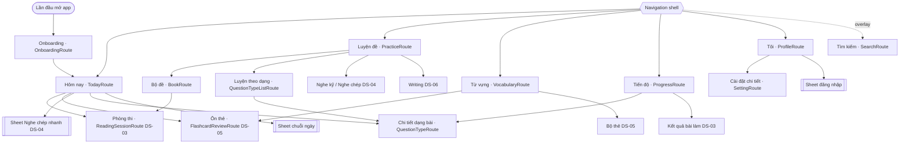
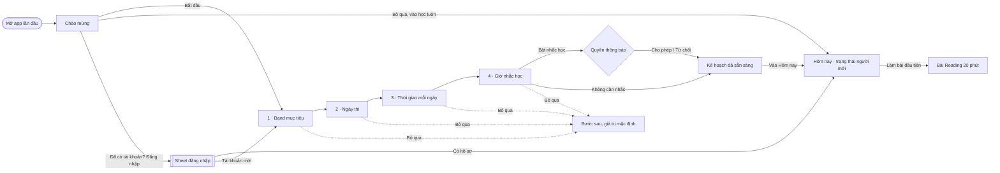
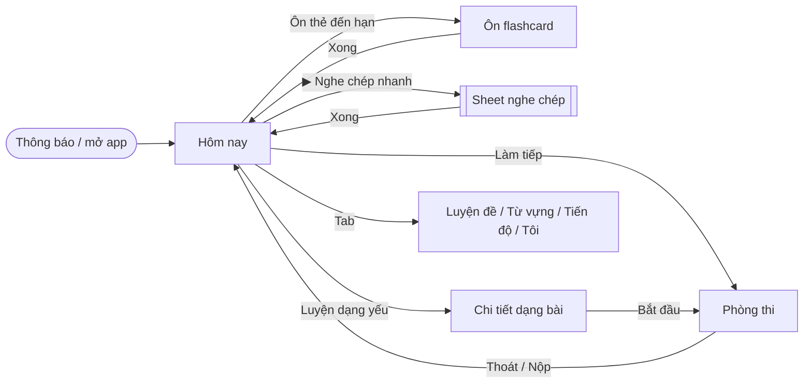
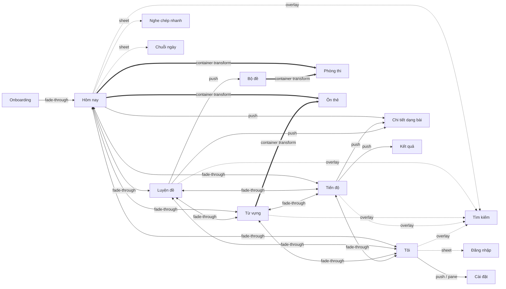

# Information architecture, navigation and home

Where everything lives, how the learner moves between areas, and what the app shows when it opens. Builds on the
visual language, tokens, components and motion of [`../direction/README.md`](../direction/README.md) (DS-01); the
implementation is AND-19. Areas owned by other design tasks (test room DS-03, listening study DS-04, vocabulary DS-05,
writing DS-06) are only shown at the level of their entry points and top-level roots.

**Mockups** (open in any modern browser; each has light/dark, phone/desktop, state and Reduce Motion switches, a
replay button and a haptic log, like the DS-01 mockups):

| File | Shows |
| --- | --- |
| [`mockups/navigation.html`](mockups/navigation.html) | Navigation shell on phone (bottom bar), tablet (rail) and desktop (sidebar); all five destinations; tab fade-through with kept scroll; reselect to top; global search (phone overlay, desktop ⌘K palette); offline and reconnected banners; the clickable transition map |
| [`mockups/home.html`](mockups/home.html) | "Hôm nay" in every state; continue card → test room, due cards → review (container transforms); quick dictation sheet; streak sheet; weakest type → detail push |
| [`mockups/onboarding.html`](mockups/onboarding.html) | Welcome, the four steps (target band, exam date, daily minutes, reminder time), notification permission and denial, plan summary → Hôm nay |
| [`mockups/progress.html`](mockups/progress.html) | "Tiến độ": band per skill, band trend, study time, accuracy by question type, streak calendar, history; all states |
| [`mockups/profile.html`](mockups/profile.html) | "Tôi": signed out / signed in / syncing / sync error / offline, sign-in sheet in every state, settings detail (phone push, desktop two-pane) |

Mockups are self-contained HTML (inline CSS/JS, fonts from Google Fonts only), use the DS-01 token values, and compute
every spring from the DS-01 spring tokens. Sample content (tests, passages, words) is illustrative; the book and test
labels only show where real content appears.

## 1. The job

One Vietnamese learner, four devices, every day (see DS-01 §1 for the moments). For navigation and home the jobs are:

| When | Device | The learner wants to… |
| --- | --- | --- |
| First launch | Phone | Get started in under a minute without filling a form; skip everything if they want |
| Every morning, 10 minutes | Phone, one hand | Open the app and start the right thing in one tap |
| Lunch, 20 minutes | Phone | Continue the passage they left yesterday |
| Evening, 60 minutes | Desktop or Mac | Pick a full test, then look at progress; never touch the mouse |
| Weekend | Any | See how they are improving and what to fix next week |
| Anytime | Any | Find a word, a test or a setting by typing its name |

User stories:

- As a learner I open the app and within two seconds know what to do today, and I can start it with one tap.
- As a learner I reach every feature in at most two taps from any top-level destination.
- As a new learner I set my goal, exam date, daily time and reminder in under a minute, or skip it entirely.
- As a learner who missed days I am welcomed back, not shamed.
- As a learner without a network the app works and tells me calmly that it will sync later.
- As a learner on two devices I sign in once and my work follows me; I never have to sign in to study.
- As a keyboard user I switch areas with ⌘/Ctrl 1–5, search with ⌘/Ctrl K and never need the mouse.
- As a screen-reader or Reduce Motion user I get the same structure and the same information.

## 2. References — what to borrow, what to avoid

Patterns only; no screenshots, visuals or assets are copied.

| Reference | Borrow | Avoid |
| --- | --- | --- |
| [HIG — Tab bars](https://developer.apple.com/design/human-interface-guidelines/tab-bars), [Sidebars](https://developer.apple.com/design/human-interface-guidelines/sidebars) | 3–5 tabs named by nouns, each with its own stack; reselect pops to root then scrolls to top; sidebar on iPad/Mac with the same destinations | Hiding tabs or changing their order by context |
| [HIG — Onboarding](https://developer.apple.com/design/human-interface-guidelines/onboarding) | Teach by doing, ask only what personalises, defer permissions until the moment they matter, always skippable | Splash tours of features, sign-in walls |
| [HIG — Searching](https://developer.apple.com/design/human-interface-guidelines/searching) | Search from every top-level screen, recent searches, scopes, results while typing | Search buried in a menu |
| [Material 3 — Navigation suite / adaptive](https://m3.material.io/foundations/layout/applying-layout/window-size-classes), [Navigation bar](https://m3.material.io/components/navigation-bar/overview), [Navigation rail](https://m3.material.io/components/navigation-rail/overview) | Bar on compact, rail on medium, drawer/sidebar on expanded; Android back from another tab returns to the start destination | Hamburger menus, FAB as primary action |
| [Android predictive back](https://developer.android.com/guide/navigation/custom-back/predictive-back-gesture) | Back-to-home preview on the start destination, cross-tab back to Hôm nay | — |
| Apple Fitness summary, Apple Health "Highlights" | One calm summary of the day, rings, trends explained in words ("+0.5 trong 30 ngày") | Dense dashboards of numbers without meaning |
| [Things 3](https://culturedcode.com/things/), [Linear](https://linear.app) command palette | "Today" as the start, ⌘K palette that also runs actions | Power-user jargon |
| Duolingo / Study4 home | A clear daily goal and a one-tap start | Gamified pressure, red streak-loss alerts, mascot noise, ads |
| [Raycast](https://www.raycast.com) / Spotlight | Results grouped by type, keyboard-first, arrow + Enter | — |

## 3. Information architecture

### 3.1 Top-level destinations

Five destinations, the same on every platform and in the same order. Labels are short Vietnamese nouns that fit the
phone tab bar at 200 % text (they wrap to two lines rather than truncate).

| # | Destination | Icon (Material / SF) | Answers | Root contents |
| --- | --- | --- | --- | --- |
| 1 | **Hôm nay** | `wb_sunny` / `sun.max` | What should I do now? | Continue card, today's plan (due cards, weakest-type drill, quick dictation), weekly goal and streak, weakest question type |
| 2 | **Luyện đề** | `menu_book` / `book` | What can I practise? | Skill switch Reading · Listening · Writing (Speaking later), Cambridge books → tests, "Luyện theo dạng" (question types), study tools: Nghe kỹ, Nghe chép chính tả (DS-03/04/06 own the screens) |
| 3 | **Từ vựng** | `style` / `rectangle.stack` | Which words do I need to remember? | Due-cards hero, decks, saved words, study modes (DS-05 owns the screens) |
| 4 | **Tiến độ** | `monitoring` / `chart.line.uptrend.xyaxis` | How am I improving? | Band per skill, trend, study time, accuracy by question type, streak calendar, history |
| 5 | **Tôi** | `person` / `person.crop.circle` | Who am I here, and how does the app behave? | Account and sync, goals (band, exam date, daily time, reminder), appearance, study, data, about |

**Why these five**

- **Hôm nay first and as the start destination.** The core story is "open → know what to do in two seconds". A
  dedicated Today screen that assembles work from every area is the only way to make the most common task one tap.
- **Luyện đề groups every exam skill.** Reading, Listening, Writing (and Speaking in phase 4) are all "practise with a
  test or a part of one", so one library with a skill switch scales without adding tabs. Splitting skills into tabs would
  use 3–4 of 5 slots and leave no room for vocabulary or progress. "Luyện đề" is the term Vietnamese learners already
  use (replacing today's "Luyện tập", which is vaguer).
- **Từ vựng is its own tab** because flashcards are a daily habit with its own rhythm (due counts, spaced repetition)
  and the second most frequent task after "continue".
- **Tiến độ is separate from Hôm nay** so home stays a short, actionable list; deep analysis lives one tap away. Home
  shows only the one number that drives today's action (weakest type) and the weekly ring.
- **Tôi** holds everything about the person and the app (account, goals, settings) behind one recognisable label;
  settings are not a tab of their own because they are rarely used.
- **Search is global, not a tab:** a sixth tab would crowd the phone bar; search is reachable from every top-level
  screen in one tap (phone) or ⌘K (desktop).

Alternatives considered and rejected: four tabs with progress inside home (home becomes a dashboard and loses its single
focus); "Học" + "Thi" split (the same tests serve both; practice vs exam is a mode chosen when opening a test, DS-03);
a centre "Bắt đầu" button (the continue card already is the one-tap start, and a centre FAB-like tab breaks the bar's
noun pattern).

### 3.2 Everything within two taps

From any top-level root, every feature is reachable in ≤ 2 taps (a tab switch counts as one).

| Feature | Path | Taps |
| --- | --- | --- |
| Continue the last test | Hôm nay → **Làm tiếp** | 1 |
| Review due flashcards | Hôm nay → **Ôn 24 thẻ đến hạn** (or Từ vựng → **Ôn ngay**) | 1 |
| Quick dictation | Hôm nay → ▶ on **Nghe chép nhanh** | 1 |
| Drill the weakest question type | Hôm nay → **Luyện Matching Headings** | 1 |
| Streak details | Hôm nay → streak pill | 1 |
| Open a specific test | Luyện đề → book → test (or search, 2) | 2–3 † |
| Practise one question type | Luyện đề → **Luyện theo dạng** → type | 2 |
| Intensive listening / dictation library | Luyện đề → **Nghe kỹ** / **Nghe chép chính tả** | 2 |
| Write an essay | Luyện đề → Writing segment → prompt | 2–3 † |
| A deck / a saved word | Từ vựng → deck / word | 2 |
| Accuracy by question type, history | Tiến độ (scroll) | 1 |
| Change goal, exam date, daily time, reminder | Tôi → row | 2 |
| Appearance, Reduce Motion, haptics | Tôi → row (toggles inline) | 2 |
| Sign in | Tôi → **Đăng nhập** | 2 |
| Anything by name | Search (phone icon / ⌘K) → result | 2 |

† Choosing *which* test is content browsing, not navigation depth; search and the continue card shortcut it.

### 3.3 Hierarchy and routes

Route changes for AND-19 (names per `code-conventions`; the current app has `PracticeRoute`, `VocabularyRoute`,
`ProgressRoute`, `ProfileRoute`):

| Route | Kind | Notes |
| --- | --- | --- |
| `TodayRoute` | new `TopLevelRoute`, start destination | First in the bar; replaces `PracticeRoute` as `startRoute` |
| `PracticeRoute`, `VocabularyRoute`, `ProgressRoute`, `ProfileRoute` | existing `TopLevelRoute` | Order: Today, Practice, Vocabulary, Progress, Profile |
| `OnboardingRoute` | new, full screen outside the shell | Shown when onboarding was never completed or skipped |
| `SearchRoute(query: String = "")` | new, overlay above the current tab | Phone: full-screen overlay; desktop: palette dialog (not a stack entry) |
| `QuestionTypeRoute(typeId: String)` | new | Detail of one question type: accuracy, tips, suggested sets (content from DS-03) |
| `SettingRoute(settingId: String)` | new | Detail pages under Tôi (`reminder`, `appearance`, `goal`, `study`, `data`, `about`) |
| Sheets (streak, quick dictation, sign-in) | not routes | Local UI state of the screen that opens them |

Resource keys follow `<feature>_<screen>_<meaning>`: `today_home_continue`, `onboarding_band_title`,
`navigation_tab_today`, `search_overlay_placeholder`, `profile_sign_in_title`.

### 3.4 Adaptive navigation (`LpNavigationSuite`)

| Window width | Pattern | Layout |
| --- | --- | --- |
| Compact < 600 (phones) | **Bottom tab bar** | 84 high incl. home indicator (Android: 80 + gesture inset), translucent `opacity.bar` + blur, hairline top; five items, icon 28 + `caption` label; selected = `primary` + filled icon; search is an icon button (48) in each root's large-title row |
| Medium 600–839 (foldables, tablet portrait) | **Navigation rail** | 80 wide on `surfaceContainerLow`, hairline trailing; top: search icon button; centre: five items (icon 24 in a 56 × 32 pill indicator + `caption` label); bottom: streak pill (flame + number) |
| Expanded ≥ 840 (tablet landscape, desktop, Mac) | **Sidebar** | 248 wide on `surfaceContainerLow`; app mark + name; search field ("Tìm kiếm" + `⌘K` hint); five items (48 high, icon 24 + `label`, shortcut hint `⌘1`–`⌘5` on hover/focus); spacer; streak row; sync status line |

- All three variants are one component with one destination list, one selection state and the same badge rule.
- **Badge:** only Từ vựng shows a badge, the number of due cards (`caption2` on `primary`, "99+" cap), because it is the
  one count that asks for action. No badge reaches zero-dot noise: when nothing is due there is no badge.
- macOS: the sidebar is a native `NavigationSplitView` sidebar (translucent material); the window toolbar holds the
  screen title and search. iPadOS: `TabView` with `.sidebarAdaptable` gives bar ↔ sidebar for free; the Android
  medium rail maps to the iPad compact-width bar (iPad has no rail).
- Full-screen flows hide the navigation suite: onboarding, test room, flashcard review session, writing room, dictation
  session. They return to the tab they came from.
- 200 % text: bar labels wrap to two lines (bar grows to 96); rail labels wrap; sidebar items grow in height.

### 3.5 Back, reselect and state

| Action | Behaviour |
| --- | --- |
| Switch tab | Fade-through; each tab keeps its own back stack and scroll position (existing `NavState`) |
| Reselect the current tab | If the tab has pushed screens, pop to its root (pop animation); if at root, scroll to top with `spring.smooth`; at the top of Luyện đề / Từ vựng it focuses search |
| Android back at a tab root other than Hôm nay | Switch to Hôm nay (fade-through) |
| Android back at the Hôm nay root | Leave the app (system predictive back-to-home) |
| iOS swipe back / desktop `Esc`, `⌘[` | Pop within the tab only; never crosses tabs |
| Process death / configuration change | Selected tab, every stack and onboarding progress restore (`@Serializable` routes) |
| Opening a full-screen flow | Pushed above the shell; closing returns to the exact tab, stack and scroll position |

### 3.6 Deep links and notifications

Paths (scheme chosen by AND-19, e.g. `<scheme>://today`): `today`, `today/review` (opens the due-card session over
Hôm nay), `practice/tests/{testId}`, `vocabulary`, `progress`, `settings/reminder`. Deep links select their tab and
build its stack (root + target) so back always lands somewhere sensible.

The daily reminder (§5.5 step 4) is the only notification. It is sent once at the chosen time, and only if the learner
has not studied yet that day:

- Title "Đến giờ học rồi" · body "Kế hoạch hôm nay: 20 phút · 24 thẻ đang chờ ôn." · tap → Hôm nay.
- No streak-loss warnings, no evening "you forgot" follow-ups, no app-icon badge by default.

### 3.7 Flows

**First launch**

**Daily open**

## 4. Screen catalogue

| Screen | Owner | Spec |
| --- | --- | --- |
| Navigation shell | DS-02 | §5.1 |
| Hôm nay | DS-02 | §5.2 |
| Quick dictation sheet (container) | DS-02 entry, DS-04 content | §5.3 |
| Streak sheet | DS-02 | §5.4 |
| Onboarding | DS-02 | §5.5 |
| Tiến độ | DS-02 | §5.6 |
| Chi tiết dạng bài (question type detail) | DS-02 layout, DS-03 tips content | §5.7 |
| Tôi and settings | DS-02 | §5.8 |
| Sign-in sheet | DS-02 | §5.9 |
| Offline and sync feedback (global) | DS-02 | §5.10 |
| Global search | DS-02 | §5.11 |
| Luyện đề root, Từ vựng root | DS-02 skeleton, DS-03/04/05/06 content | §5.12 |

## 5. Screen specs

Common to every top-level root: `LpLargeTitleBar` (large title that collapses into the translucent bar on scroll), phone
search icon button at the trailing edge of the title row, screen margins 20 / 24 / 32, content max 1080 on desktop,
`stagger.list` on first appearance only (not on tab return). Copy is in Vietnamese per DS-01 §4.

### 5.1 Navigation shell

**Purpose:** move between the five areas instantly and always know where you are.

| Size class | Layout |
| --- | --- |
| Phone | Content under a translucent bottom bar; content scrolls beneath it (bottom padding 100). |
| Tablet / foldable | Rail on the leading edge; content fills the rest with margin 24; two-column content where §5.x says so. |
| Desktop | Sidebar 248 + content; window title bar shows the app name; content max 1080 centred. |

Components: `LpNavigationSuite` (bar / rail / sidebar), `LpSearchField` (sidebar), `LpIconButton` (search),
`LpStreakBadge` (rail, sidebar), `LpBanner`.

| State | What the learner sees | Copy |
| --- | --- | --- |
| Default | Five destinations, current one selected | Hôm nay · Luyện đề · Từ vựng · Tiến độ · Tôi |
| With badge | Number on Từ vựng | screen reader: "Từ vựng, 24 thẻ đến hạn" |
| Offline | Sidebar status line turns to cloud-off; banner on data screens (§5.10) | "Ngoại tuyến" |
| Syncing | Sidebar status line with a small spinner | "Đang đồng bộ…" |
| Synced | Sidebar status line | "Đã đồng bộ · 2 phút trước" |
| Hidden | Full-screen flows | — |

Accessibility: the bar/rail/sidebar is a `tablist` ("Điều hướng chính"); each item announces "Hôm nay, tab 1 trên 5,
đã chọn"; focus order bar items left → right after the content; selection is shown by colour **and** filled icon
**and** (rail/sidebar) the indicator pill. Keyboard: `⌘/Ctrl 1–5` destinations, `⌘/Ctrl K` search, `⌘/Ctrl ,` Tôi →
settings, `Esc` / `⌘[` back, `Tab` cycles sidebar → content.

Motion: tab fade-through (DS-01 §6.2), selected indicator in rail/sidebar slides between items (`spring.snappy`), icon
fill cross-fades (`duration.short`), badge count rolls (`spring.gentle`), tab tap fires `selection` haptic. Reduce
Motion: indicator jumps, fade-through becomes a cross-fade `duration.short`.

### 5.2 Hôm nay

**Purpose:** what to do now, and a glance at how I am doing. **Primary action:** the hero card's button (Làm tiếp /
Bắt đầu / Làm bài đầu tiên).

Order of content (phone, top to bottom) — the order is the priority:

1. **Header:** date caption with exam countdown ("Thứ Sáu, 2 tháng 10 · còn 71 ngày đến kỳ thi"), large title
   "Hôm nay"; trailing: search icon button, streak pill.
2. **Offline banner** when offline (§5.10).
3. **Hero card** (`LpContinueCard`): the single next best thing.
   - A test in progress → "Đang làm · Cambridge 18 · Test 2 · Reading · Passage 2 · Câu 18/40", progress bar, "Còn 34
     phút · 17 câu đã làm", **Làm tiếp**.
   - No test in progress → the first undone plan item as hero: "Bắt đầu kế hoạch hôm nay · 3 việc · 20 phút",
     **Bắt đầu**.
   - Plan done → quiet done card: "Xong kế hoạch hôm nay" + "Học thêm" text button (opens Luyện đề).
4. **Kế hoạch hôm nay** (`LpSectionHeader` "Kế hoạch hôm nay" + trailing "1/3 · 20 phút") with `LpPlanRow`s:
   - **Ôn 24 thẻ đến hạn** · "Từ vựng · khoảng 5 phút" → container transform into the review session.
   - **Luyện Matching Headings** · "Dạng bạn hay sai nhất · 12 phút" → push question type detail.
   - **Nghe chép nhanh** · "3 câu · Cambridge 17 · Test 3 · Section 2" with an inline ▶ button → quick dictation
     sheet (§5.3). Tapping the row elsewhere does the same.
   - Done rows: title in `onSurfaceVariant`, trailing ✓ `correct`, announced "Đã xong".
5. **Mục tiêu tuần** card: ring (`progressRing.medium`, `tertiary`), centre "3/5 buổi", headline "Mục tiêu tuần",
   "Còn 2 buổi nữa là đạt mục tiêu tuần", seven day dots (T2…CN; studied = filled `tertiary`, rest day = outlined with a
   small moon icon, today = bold label).
6. **Cần luyện thêm** (`LpStatTile`): weakest question type with accuracy bar and trend ("Matching Headings · 58% đúng ·
   +6% so với tuần trước"), "Xem tất cả" → Tiến độ, scrolled to the accuracy section.

| Size class | Layout |
| --- | --- |
| Phone | Single column as above; bottom bar. |
| Tablet | Rail; two columns 1:1 — hero + plan left, goal + weakest right. |
| Desktop | Sidebar (streak lives there, so no streak pill in the title row; search lives in the sidebar). Two columns 7/5: hero + plan left; goal + weakest right. Hero button not full width. |

Components: `LpLargeTitleBar`, `LpIconButton`, `LpStreakBadge`, `LpBanner`, `LpContinueCard`, `LpSectionHeader`,
`LpPlanRow` (new), `LpCard`, `LpProgressRing`, `LpStatTile`, `LpSkeleton`, `LpEmptyState`, `LpErrorState`, `LpSheet`,
`LpSnackbar`.

| State | What the learner sees | Copy |
| --- | --- | --- |
| In progress (default) | Continue hero, plan 1/3 done, ring 3/5 | "Làm tiếp", "Còn 2 buổi nữa là đạt mục tiêu tuần" |
| New day, nothing in progress | Plan hero "Bắt đầu" | "Bắt đầu kế hoạch hôm nay" / "3 việc · 20 phút" / "Bắt đầu" |
| Plan done | Calm done hero with small illustration (sunrise), every row ✓, ring advanced by one | "Xong kế hoạch hôm nay" / "Bạn đã học 22 phút. Hẹn bạn ngày mai nhé." / "Học thêm" |
| Goal reached | Ring full in `tertiary` with ✓, one-time success haptic | "Đạt mục tiêu tuần!" / "5/5 buổi · tuần sau giữ nhịp này nhé" |
| Welcome back (≥ 2 days missed) | Hero says hello, plan shortened to 10 minutes; streak pill shows the new count without warning colour | "Chào bạn quay lại" / "Làm 5 phút để lấy lại nhịp nhé." / "Bắt đầu 5 phút" |
| New learner (no attempts) | Empty state with book illustration; goal card only if onboarding set a goal | "Chào bạn!" / "Làm một bài Reading 20 phút để biết bạn đang ở đâu. Kế hoạch hằng ngày sẽ dựa trên kết quả này." / "Làm bài đầu tiên" · "Xem các bộ đề" |
| Loading (> 300 ms) | Skeletons in the shape of hero, plan rows and ring | screen reader: "Đang tải kế hoạch hôm nay" |
| Error | Error state replaces content; bars stay | "Chưa tải được kế hoạch hôm nay" / "Kiểm tra kết nối rồi thử lại nhé." / "Thử lại" |
| Offline | Cached content + banner; items that need the network (none on home) would show "Cần có mạng" | "Đang ngoại tuyến · Bài làm vẫn được lưu và sẽ đồng bộ khi có mạng." |

The plan, ring and streak are computed on the device from local data, so home works offline; the error state only
appears if the local database cannot be read (rare) or on first sync with no cache.

Accessibility: hero is one card with a single button; the card's text is read before the button ("Đang làm, Cambridge 18
Test 2, câu 18 trên 40, còn 34 phút. Làm tiếp, nút"). Plan rows are single focusable elements with title, subtitle and
state; in "Nghe chép nhanh" the ▶ (48) is the row's single focusable element, labelled with the row's text ("Nghe chép
nhanh, 3 câu, Cambridge 17 Test 3 Section 2. Bắt đầu"), and tapping the rest of the row is a pointer convenience. Ring: "Mục tiêu tuần: 3 trên 5
buổi"; day dots are one element: "Tuần này: đã học thứ Hai, thứ Ba, thứ Năm; thứ Tư nghỉ". Streak pill: "Chuỗi 12 ngày,
mở chi tiết". At 200 % text, the desktop and tablet two-column layouts collapse to one column. Keyboard: `Tab` follows
reading order, `Enter` on the hero opens the test room, `⌘/Ctrl ↩` starts the first undone plan item.

Motion:

| Element | Trigger | Animation | Token | Reduce Motion |
| --- | --- | --- | --- | --- |
| First load | Screen appears (cold start) | Header, hero, rows, cards rise 12 + fade, staggered; ring sweeps; counters roll | `spring.smooth`, `stagger.list`, `spring.gentle` | Fade all at once, values jump |
| Hero → test room | Làm tiếp | Container transform; `impact light` | `spring.smooth` | Cross-fade `duration.short` |
| Due row → review | Tap row | Container transform from the row; `impact light` | `spring.smooth` | Cross-fade |
| Plan row → type detail | Tap row | Push with parallax | `spring.smooth` | Cross-fade |
| ▶ quick dictation | Tap | Sheet rises; ▶ icon morphs to the sheet's play button position (shared icon) | `spring.smooth` | Fade |
| Plan item completed | Return from a finished activity | Row's trailing chevron cross-fades to ✓ which pops (scale 0.6 → 1), header counter rolls 1/3 → 2/3, ring advances | `spring.bouncy`, `spring.gentle` | Instant ✓ and values |
| Hero swap | Plan item finished changes the hero | `AnimatedContent`: old hero fades out 90, new fades in from scale 0.98 with `animateContentSize` | `duration.medium`, `spring.smooth` | Cross-fade |
| Goal reached | Ring reaches 5/5 | Ring fills, centre number cross-fades to ✓ (pop), one `success` haptic, once per week | `spring.gentle`, `spring.bouncy` | Static ✓, haptic stays |
| Streak pill | Today's first study minute | Flame scales 1 → 1.15 → 1 once, number rolls | `spring.bouncy` | Number changes |

Progress shown and its meaning (computed in `shared`, AND-19):

| Value | Definition |
| --- | --- |
| Daily plan | Built each morning to fit the daily minutes: (1) due cards, ~12 s per card, capped at 40 % of the time; (2) the weakest question type drill (10–15 min); (3) a quick dictation of 3 sentences (3 min). An in-progress test is the hero and not counted in the plan. Items done elsewhere in the app count. |
| Buổi (session) | A day with at least the daily minutes of study (10 min minimum). |
| Weekly goal | Sessions this week (Mon–Sun) vs target (default 5, set in Tôi → Mục tiêu). |
| Streak | Consecutive days with ≥ 5 minutes; one free rest day per week keeps the streak (DS-01). |
| Weakest type | Lowest accuracy over the last 30 days among types with ≥ 6 answered questions; trend vs the previous 7 days. |
| Exam countdown | Days until the exam date from onboarding; hidden if none. |

### 5.3 Quick dictation sheet

**Purpose:** a 3-minute warm-up without leaving home. The dictation interaction itself (typing area, word feedback,
hints, scoring) is DS-04's; this spec defines the entry and container.

- Phone: `LpSheet` with medium detent (~60 %), drag to large; header "Nghe chép nhanh · Câu 1/3", source caption, play
  button (56, `primaryContainer`), speed chip "1×", text field "Gõ những gì bạn nghe…", **Kiểm tra** primary button.
  The keyboard pushes the sheet to the large detent.
- Desktop: centred dialog 560 wide; `Space` play/pause, `⌘/Ctrl ↩` check, `Tab` to next sentence.
- After the third sentence: summary in place ("3/3 câu · 92% từ đúng" + "Xong" → closes, plan row gets ✓).

| State | Copy |
| --- | --- |
| Ready | "Nghe chép nhanh", "Câu 1/3", "Chạm để nghe" |
| Playing | play icon → pause, waveform progress (DS-04) |
| Checked | Word-level feedback (DS-04) + "Câu tiếp" |
| Done | "Xong 3 câu!" / "92% từ đúng · 1 từ cần ôn: *deteriorate*" / "Lưu từ" · "Xong" |
| Offline, audio not downloaded | "Câu này chưa được tải về máy. Kết nối mạng để nghe nhé." / "Đóng" |
| Error | "Chưa phát được âm thanh" / "Thử lại" |

Closing midway keeps progress ("Câu 2/3" shown on the row: "Đang làm · 1/3 câu"). Accessibility: focus starts on the
play button; feedback is announced per word count ("Đúng 11 trên 12 từ"); the sheet title is the dialog name.

### 5.4 Streak sheet

Opened from the streak pill (phone, tablet rail) or the sidebar streak row (desktop).

- Flame tile + "Chuỗi 12 ngày" (`title2`) + "Kỷ lục của bạn: 21 ngày".
- This week's seven days (28 dots, labels below; rest day shows a moon icon).
- Explanation: "Học ít nhất 5 phút mỗi ngày để giữ chuỗi. Lỡ một ngày cũng không sao: mỗi tuần bạn có một ngày nghỉ mà
  chuỗi vẫn được giữ."
- "Xem lịch học" text button → Tiến độ, scrolled to the streak calendar; "Đã hiểu" primary.

States: active today ("Hôm nay bạn đã học 14 phút"), not yet today ("Học 5 phút hôm nay để lên 13 ngày"), rest day used
("Tuần này bạn đã dùng ngày nghỉ"), no streak ("Bắt đầu chuỗi mới hôm nay nhé."). Never a "lost" message.

### 5.5 Onboarding

**Purpose:** personalise the daily plan in under a minute; never block studying. **Primary action:** "Tiếp tục".

Shown on first launch (and again only if the learner chose "Bỏ qua, vào học luôn" and later opens Tôi → Mục tiêu, which
uses the same step screens). Values are stored locally and synced after sign-in. Defaults when skipped: band 6.5, no
exam date, 20 minutes, no reminder.

| Step | Title | Control | Helper / extra |
| --- | --- | --- | --- |
| Welcome | "Luyện IELTS mỗi ngày, nhẹ mà chắc" | Sunrise-over-notebook illustration | "Trả lời 4 câu ngắn để có kế hoạch hợp với bạn. Chưa tới 1 phút." · **Bắt đầu** · "Bỏ qua, vào học luôn" · footer "Đã có tài khoản? **Đăng nhập**" |
| 1 / 4 | "Bạn muốn đạt band bao nhiêu?" | Radio grid of 8 chips 5.0 … 8.5 (48 high, 4 columns) | "Nhiều chương trình du học yêu cầu 6.5–7.0. Bạn đổi được bất cứ lúc nào." |
| 2 / 4 | "Khi nào bạn thi?" | Option rows: "Đã có ngày thi" (reveals a native date picker), "Khoảng 1–3 tháng nữa", "Khoảng 3–6 tháng nữa", "Chưa có kế hoạch" | After a date: "Còn 71 ngày · khoảng 50 buổi học" |
| 3 / 4 | "Mỗi ngày bạn học được bao lâu?" | `LpChoiceCard` list: 10 phút "Nhẹ nhàng · ôn thẻ và nghe chép", 20 phút "Đều đặn · thêm một dạng bài" (tag "Gợi ý"), 30 phút "Nghiêm túc · thêm một passage", 60 phút "Tăng tốc · gần một bài thi" | "Ít mà đều quan trọng hơn nhiều mà ngắt quãng." |
| 4 / 4 | "Nhắc bạn học lúc mấy giờ?" | Chips "7:00 sáng", "12:30 trưa", "20:00 tối", "Giờ khác…" (native time picker) | Preview of the notification; **Bật nhắc học** (asks the OS permission now, not earlier) · "Không cần nhắc" |
| Ready | "Kế hoạch của bạn đã sẵn sàng" | Summary inset list: Mục tiêu · Band 7.0; Ngày thi · 12/12 · còn 71 ngày; Mỗi ngày · 20 phút; Nhắc học · 20:00 | "Bắt đầu bằng một bài Reading 20 phút để biết bạn đang ở đâu." · **Vào Hôm nay** |

Chrome per step: top bar with back (steps 2–4), a 4-segment `LpProgressBar` (segments fill as steps complete), "Bỏ qua"
text button trailing (skips this step with its default). The primary button sits at the bottom in thumb reach and is
disabled until a choice is made (steps 1–3); step 4 has two actions.

| Size class | Layout |
| --- | --- |
| Phone | Full screen, title `title1` top-left under the bar, controls below, primary button pinned above the home indicator. |
| Tablet / desktop | No navigation suite; a centred column 560 wide on `surface`, illustration 160; primary button inline under the controls (not pinned). |

Components: `LpTopBar` (back + skip), `LpProgressBar` (segmented variant, new), `LpChoiceChip` (`LpAnswerChip` style,
radio semantics), `LpOptionRow`, `LpChoiceCard` (new), `LpPrimaryButton`, `LpTextButton`, `LpListRow`, `LpSheet`
(sign-in), platform date/time pickers.

| State | Copy |
| --- | --- |
| Nothing chosen | Primary disabled; screen reader on the button: "Tiếp tục, chọn một mục trước" |
| Chosen | Chip/card selected, primary enabled |
| Exam date chosen | "Còn 71 ngày · khoảng 50 buổi học" |
| Exam date in the past | Inline warning under the picker: "Ngày này đã qua. Chọn một ngày sắp tới nhé." (primary disabled) |
| Notification permission granted | Ready screen row "Nhắc học · 20:00" |
| Permission denied | Inline info under the chips: "Thông báo đang tắt. Bạn bật lại trong Cài đặt hệ thống bất cứ lúc nào." + "Mở Cài đặt"; "Tiếp tục" continues; ready row "Nhắc học · Đang tắt" |
| Desktop | Reminders use the OS notification centre; if unsupported (Linux without a daemon), step 4 shows "Máy này chưa hỗ trợ nhắc học" and is skipped |

Accessibility: each step's title is a heading and receives focus on entry ("Bước 2 trên 4. Khi nào bạn thi?"); chip and
card groups are `radiogroup`s (arrow keys move, Space selects); the progress bar announces "Bước 2 trên 4"; date/time use
native accessible pickers. Keyboard: `Enter` continue, `Esc` back (welcome: nothing), `⌘/Ctrl →` skip step.

Motion:

| Element | Trigger | Animation | Token | Reduce Motion |
| --- | --- | --- | --- | --- |
| Step forward / back | Tiếp tục / back | Content slides 24 px in the direction of travel with fade (outgoing −24 + fade out 90, incoming from +24); the bar and the bottom button stay still | `spring.smooth` | Cross-fade `duration.short` |
| Progress segment | Step completed | Segment fills from the leading edge | `spring.gentle` | Instant |
| Chip / card select | Tap | DS-01 chip selection; selection haptic | `spring.snappy` | Colour only |
| Date row reveal | "Đã có ngày thi" | Picker expands (`animateContentSize`), countdown fades in | `spring.smooth` | Instant |
| Ready summary | Arrive | Rows stagger in; the check illustration draws its stroke | `stagger.list`, `spring.gentle` | Fade |
| Ready → Hôm nay | Vào Hôm nay | Onboarding fades out 90 while the shell fades in from scale 0.98 (fade-through); home runs its first-load stagger | `duration.medium` | Cross-fade |

### 5.6 Tiến độ

**Purpose:** see how I am improving and what to fix next. **Primary action:** none dominant; the most useful tap is the
weakest question type row (→ detail and drill).

Content (phone order):

1. Large title "Tiến độ"; trailing search; below it an `LpSegmentedControl` "7 ngày · 30 ngày · Tất cả" that drives
   every section below.
2. **Band ước tính** card: three `LpBandTile`s (Reading 6.5 ↑0.5, Listening 6.0 –, Writing 5.5 ↑0.5), the target
   "Mục tiêu 7.0" as a caption; tapping a tile selects it for the trend chart.
3. **Xu hướng band** chart (`LpLineChart`): selected skill's estimated band per test over the range, dashed target line
   labelled "Mục tiêu 7.0", last point emphasised with its value; caption in words: "Reading tăng 0.5 trong 30 ngày qua".
4. **Thời gian học** (`LpBarChart`): minutes per day (7 ngày) or per week (30 ngày, Tất cả), goal line at the daily
   minutes, total "2 giờ 20 phút tuần này · trung bình 20 phút/ngày".
5. **Độ chính xác theo dạng câu hỏi**: inset list sorted weakest first; each row: type name, accuracy % (tabular), mini
   bar, trend arrow + delta; tap → question type detail (§5.7).
6. **Chuỗi ngày**: month calendar (`LpStreakCalendar`), studied days filled `tertiary` (intensity by minutes in two steps),
   rest days outlined with the moon, today ringed; "Chuỗi 12 ngày · kỷ lục 21 ngày".
7. **Lịch sử bài làm**: last five attempts (test name, date, band/score) → result screen (DS-03); "Xem tất cả".

| Size class | Layout |
| --- | --- |
| Phone | Single column. Charts full width, 160 high. |
| Tablet | Two columns: band + trend left, time + streak right; accuracy and history full width. |
| Desktop | Two columns 7/5: band, trend, accuracy left; time, streak, history right. Charts 200 high with hover tooltips. |

Components: `LpLargeTitleBar`, `LpSegmentedControl`, `LpCard`, `LpBandTile` (new), `LpLineChart` (new), `LpBarChart`
(new), `LpListRow` + `LpProgressBar`, `LpStreakCalendar` (new), `LpSkeleton`, `LpEmptyState`, `LpErrorState`,
`LpBanner`.

Chart rules: one series per chart in `primary` (band, time) with `outlineVariant` grid and `onSurfaceVariant` axis labels
(`caption`); the target/goal line is dashed `tertiary` and labelled in text (never colour alone); bars and points
animate from the baseline; values are tabular. Every chart has a one-line summary in words above it and is reachable as
a table ("Xem dạng bảng" toggles a simple table for screen readers and 200 % text).

| State | What the learner sees | Copy |
| --- | --- | --- |
| Content | All sections | "Reading tăng 0.5 trong 30 ngày qua" |
| Little data (< 3 tests in range) | Band tiles show "—" for skills without tests; the trend chart is replaced by a hint card | "Làm thêm 2 bài để thấy xu hướng band." |
| Empty (no attempts) | Empty state with chart-line illustration | "Tiến độ sẽ hiện ở đây" / "Sau bài làm đầu tiên, bạn sẽ thấy band ước tính và dạng câu hỏi cần luyện." / "Làm bài đầu tiên" |
| Loading | Skeletons of tiles and charts | "Đang tải tiến độ" |
| Error | Error state | "Chưa tải được tiến độ" / "Thử lại" |
| Offline | Cached data + banner + "Cập nhật lúc 8:12" caption under the title | — |

Accessibility: each chart is an image with a label summarising it ("Biểu đồ band Reading 30 ngày: từ 6.0 lên 6.5, mục
tiêu 7.0") plus the table alternative; bar/point hover tooltips on desktop are also keyboard focusable (← → between
points). Accuracy rows announce "Matching Headings, 58 phần trăm đúng, tăng 6 phần trăm". The segmented control
announces the range. Calendar days announce "Ngày 3 tháng 10, học 25 phút".

Motion: range change morphs bars from their old heights to the new values (`spring.smooth`) and, because the number of
tests differs per range, cross-fades the line chart and redraws its stroke; band tiles' numbers
roll (`spring.gentle`); line draws from left on first load (`spring.gentle`, stroke-dashoffset); bars grow from the
baseline staggered 30 ms; selecting a band tile slides the selection indicator (`spring.snappy`) and morphs the line.
Reduce Motion: values jump, line and bars appear without growth.

### 5.7 Chi tiết dạng bài (question type detail)

Pushed from Hôm nay's plan, Hôm nay's weakest tile, Tiến độ's accuracy list and Luyện đề → Luyện theo dạng.

- Title (`title1`) "Matching Headings", lead "58% đúng · 31 câu trong 30 ngày", `LpProgressBar`.
- **Bắt đầu luyện 12 phút** primary → test room in practice mode with a set of passages of this type (DS-03).
- "Mẹo" card (tips content from DS-03): 2–3 short tips.
- "Câu sai gần đây": rows → review of that question (DS-03).
- "Bộ câu gợi ý": sets with done state.

States: content, no attempts yet ("Bạn chưa làm câu Matching Headings nào. Bắt đầu với 6 câu nhé."), loading, error,
offline (sets not downloaded show "Cần có mạng" tag and are disabled). Motion: push/pop; the progress bar fills on enter.

### 5.8 Tôi and settings

**Purpose:** account, goals and how the app behaves. **Primary action:** none on the root; signed out, the account card's
"Đăng nhập" is the most prominent button.

Root (phone):

1. Large title "Tôi"; trailing search.
2. **Account card** (`LpAccountCard`, new):
   - Signed out: generic avatar, "Bạn đang học trên máy này", "Đăng nhập để đồng bộ bài làm, thẻ và tiến độ giữa các
     thiết bị." · **Đăng nhập** (secondary tonal, not primary — signing in is optional).
   - Signed in: avatar initial, name, email, sync line "Đã đồng bộ · 2 phút trước" with `cloud_done`.
3. **Mục tiêu**: Band mục tiêu · 7.0; Ngày thi · 12/12 (còn 71 ngày); Mỗi ngày · 20 phút; Số buổi mỗi tuần · 5;
   Nhắc học · 20:00. Each pushes a detail that reuses the onboarding step control.
4. **Giao diện**: Giao diện · Theo hệ thống (detail with segmented Sáng/Tối/Theo hệ thống); Cỡ chữ bài đọc · Vừa;
   Giảm chuyển động (inline `LpSwitch`); Rung phản hồi (inline switch, phone only).
5. **Học tập**: Flashcard (limits/retention, DS-05 detail); Giọng đọc Listening mặc định; Hiện đáp án khi luyện tập.
6. **Dữ liệu**: Tải đề để học ngoại tuyến · 1.2 GB trống; Xuất dữ liệu; (signed in) Đăng xuất.
7. **Thông tin**: Phiên bản · 1.0.0; Giấy phép mã nguồn mở; Góp ý.

| Size class | Layout |
| --- | --- |
| Phone | Inset grouped list; details push. |
| Tablet / desktop | Two-pane like macOS Settings: list 320 on the left (account card on top), detail on the right; the first group is selected by default; `⌘/Ctrl ,` opens it from anywhere. |

Components: `LpAccountCard` (new), `LpListRow` (value, navigation, switch variants), `LpSwitch` (new),
`LpSegmentedControl`, `LpSectionHeader`, `LpSheet`, `LpSnackbar`, `LpBanner`.

| State | Copy |
| --- | --- |
| Signed out | as above |
| Signing in | Sheet state (§5.9) |
| Signed in, synced | "Đã đồng bộ · 2 phút trước" |
| Syncing | Spinner + "Đang đồng bộ…" |
| Sync error | `warning` icon + "Chưa đồng bộ được · Thử lại" (text button), data stays on the device |
| Offline | `cloud_off` + "Ngoại tuyến · sẽ đồng bộ khi có mạng" |
| Sign out confirm | Sheet: "Đăng xuất?" / "Dữ liệu đã đồng bộ vẫn an toàn trong tài khoản. Dữ liệu trên máy này sẽ được xoá." / "Đăng xuất" (`error` text) · "Huỷ" (primary, autofocus) |
| Setting saved | Value updates in place; no toast (the control shows it) |

Accessibility: switches are rows with `role=switch` ("Giảm chuyển động, tắt"); value rows read "Band mục tiêu, 7.0, mở";
two-pane: the list is a `listbox` with the selected item announced; changing Giao diện applies immediately and is
announced. Motion: push/pop; desktop pane change cross-fades the detail (`duration.short`) with the selection indicator
sliding (`spring.snappy`); account card sign-in → signed-in content cross-fades with `animateContentSize`; switching to
dark mode cross-fades the whole window colour (`duration.medium`), no circular reveal.

### 5.9 Sign-in sheet

Opened from the Tôi account card, the onboarding welcome footer, and any "Đăng nhập để đồng bộ" prompt. Never forced.

- `LpSheet` (phone: medium detent; desktop: dialog 440): title "Đăng nhập", body "Đồng bộ bài làm, thẻ và tiến độ giữa
  điện thoại và máy tính. Không đăng nhập vẫn học được bình thường."
- Buttons (52 / 44, full width, stacked 8 apart): "Tiếp tục với Google", "Tiếp tục với Apple" (Apple platforms first),
  "Tiếp tục với email". The implementation uses each provider's official button style and logo per their brand
  guidelines; the mockup shows neutral icons only.
- Footer `footnote`: "Dữ liệu đang có trên máy này sẽ được gộp vào tài khoản."

| State | What the learner sees | Copy |
| --- | --- | --- |
| Default | Three buttons | as above |
| In progress | Pressed button shows a spinner instead of its icon, others disabled; the sheet cannot be dismissed by drag but has "Huỷ" | "Đang đăng nhập…" |
| Email | Sheet grows to the large detent: email field + "Gửi mã" → 6-digit code field | "Nhập email của bạn" / "Mã gồm 6 số đã được gửi tới tuan@… " / "Gửi lại mã sau 0:45" |
| Error | `LpBanner` (error tone) above the buttons, buttons enabled again | "Chưa đăng nhập được. Kiểm tra kết nối rồi thử lại nhé." |
| Offline | Buttons disabled, info banner | "Cần có mạng để đăng nhập." |
| Success | Sheet closes; account card cross-fades to signed in; snackbar | "Đã đăng nhập · đang đồng bộ" |

The concrete providers and the code flow depend on the backend auth task; the sheet keeps the same layout for any
subset of providers. Accessibility: focus moves to the title on open; the in-progress button announces "Đang đăng nhập";
errors are announced as alerts. Motion: sheet per DS-01; email expansion `animateContentSize` + detent change
`spring.smooth`; success: sheet closes, then the snackbar rises (`spring.smooth`).

### 5.10 Offline and sync feedback (global)

The app is offline-first: everything already on the device keeps working; only downloading new content, signing in and
AI grading need the network.

| Element | Where | Behaviour | Copy |
| --- | --- | --- | --- |
| Offline banner (`LpBanner` offline) | Top of the content of Hôm nay, Luyện đề, Từ vựng, Tiến độ, Tôi and their details — not in exam mode (DS-01: exam bar icon) | Appears 2 s after the connection drops (avoids flicker), stays while offline; one line, `info` tone, `cloud_off` icon; not dismissible but compact (56) | "Đang ngoại tuyến · Bài làm vẫn được lưu và sẽ đồng bộ khi có mạng." |
| Reconnected | Same place | Banner content cross-fades to `correct` tone with `cloud_done`, collapses after 3 s | "Đã kết nối lại · đã đồng bộ 3 bài làm" |
| Sidebar status (desktop) | Sidebar footer | Always visible, one line | "Đã đồng bộ · 2 phút trước" / "Đang đồng bộ…" / "Ngoại tuyến" |
| Needs network | On an item (test not downloaded, AI grading) | Item disabled with tag "Cần có mạng"; tapping explains in a snackbar | "Bài này chưa được tải về máy. Kết nối mạng để mở nhé." |

Accessibility: the banner is a `status` live region announced once when it appears and once on reconnect; it never
steals focus. Motion: banner slides down 16 + fades, content below moves with `animateContentSize` (`spring.smooth`);
collapse reverses. Reduce Motion: fade and instant layout.

### 5.11 Global search

**Purpose:** find any test, passage, word, question type or setting by name, and (desktop) run common actions.

Entry: phone — search icon button on every top-level root (and pull-down on Luyện đề/Từ vựng roots reveals the field,
iOS-style); tablet — rail search button; desktop — sidebar field or `⌘/Ctrl K` from anywhere except exam mode.

| Size class | Layout |
| --- | --- |
| Phone | Full-screen overlay above the tab content (bar stays hidden): search field at the top with "Huỷ", scope chips "Tất cả · Đề · Từ vựng · Dạng bài · Cài đặt", results below; keyboard open. |
| Desktop / tablet | Command palette dialog 640 wide at 20 % from the top over a scrim: field, grouped results, footer with key hints "↑↓ chọn · ↩ mở · esc đóng". |

Results, grouped in this order, max 3 per group with "Xem thêm" (phone) — palette shows max 8 total:

1. **Hành động** (desktop palette and phone zero-query only): "Ôn 24 thẻ đến hạn", "Làm tiếp Cambridge 18 · Test 2",
   "Chuyển giao diện tối".
2. **Bài thi**: books, tests, passages (title match, then passage text match with the snippet highlighted).
3. **Từ vựng**: saved words (word, meaning, deck), then words from passages not yet saved with "Lưu" inline.
4. **Dạng câu hỏi**: "Matching Headings · 58% đúng".
5. **Cài đặt**: "Nhắc học · 20:00".

Matching ignores Vietnamese diacritics and case ("nhac hoc" finds "Nhắc học"); English words match by lemma
("deteriorated" → "deteriorate").

| State | What the learner sees | Copy |
| --- | --- | --- |
| Zero query | Recent searches (chips, clear with "Xoá") + Hành động | "Tìm đề, từ vựng, cài đặt…" (placeholder) / "Tìm gần đây" |
| Typing | Results update per keystroke (debounce 120 ms), match highlighted in `primary` weight 600 | — |
| No results | Small illustration-free empty state | "Không tìm thấy “xyz”" / "Thử từ khác, hoặc kiểm tra chính tả nhé." |
| Offline | Local results only, footnote under the field | "Đang ngoại tuyến · chỉ tìm trong dữ liệu trên máy" |
| Loading (remote content > 300 ms) | Thin indeterminate bar under the field; local results already shown | — |

Accessibility: field is a `combobox` with the results `listbox`; the result count is announced politely ("5 kết quả");
↑/↓ move the active result, Enter opens, Esc clears then closes; focus returns to the opener. Phone: results are
standard rows (48+). Motion: phone — the search icon morphs into the field (shared element, `spring.smooth`), content
behind fades to `surface`, chips and results stagger; Huỷ reverses. Desktop — palette scale 0.96 → 1 + fade
(`spring.smooth`), results change with no animation (speed matters), the active row indicator slides (`spring.snappy`).
Reduce Motion: fades.

### 5.12 Luyện đề and Từ vựng roots (skeleton)

These roots are designed in detail by DS-03/04/06 and DS-05; DS-02 fixes their structure so navigation is consistent.

- **Luyện đề:** large title, search, `LpSegmentedControl` "Reading · Listening · Writing"; sections "Đang làm" (if any),
  "Bộ đề Cambridge" (book rows → book), "Luyện theo dạng" (horizontal chips of question types → detail), "Công cụ"
  (Reading/Listening: "Nghe kỹ", "Nghe chép chính tả"; Writing: "Đề Writing Task 1/2").
- **Từ vựng:** large title, search, due hero "24 thẻ đến hạn · khoảng 5 phút" + **Ôn ngay** (container transform into the
  review), "Bộ thẻ" list, "Từ mới lưu gần đây".

## 6. Transition map

Every move between top-level destinations and their main entries. Patterns and tokens from DS-01 §6.2.

| From | To | Pattern | Token | Haptic | Reduce Motion |
| --- | --- | --- | --- | --- | --- |
| Any tab | Any other tab | Fade-through (out 90 accelerate, in 160 decelerate from scale 0.98); scroll and stack kept | `duration.medium` | `selection` | Cross-fade `duration.short` |
| Tab (current) | Same tab | Pop to root, else scroll to top | `spring.smooth` | — | Instant |
| Non-Hôm nay root | Hôm nay (Android back) | Fade-through | `duration.medium` | — | Cross-fade |
| Hôm nay | Phòng thi (Làm tiếp) | Container transform from the hero card | `spring.smooth` | `impact light` | Cross-fade |
| Hôm nay / Từ vựng | Ôn flashcard | Container transform from the row / hero | `spring.smooth` | `impact light` | Cross-fade |
| Hôm nay | Nghe chép nhanh | Sheet | `spring.smooth` | — | Fade |
| Hôm nay | Chuỗi ngày | Sheet (phone) / dialog (desktop) | `spring.smooth` | — | Fade |
| Hôm nay, Tiến độ, Luyện đề | Chi tiết dạng bài | Push with parallax | `spring.smooth` | — | Cross-fade |
| Luyện đề | Bộ đề → Phòng thi | Push, then container transform from the test card | `spring.smooth` | `impact light` | Cross-fade |
| Tiến độ | Kết quả bài làm | Push | `spring.smooth` | — | Cross-fade |
| Tôi | Cài đặt chi tiết | Push (phone) / pane cross-fade (desktop) | `spring.smooth` / `duration.short` | — | Cross-fade |
| Tôi, Chào mừng | Đăng nhập | Sheet / dialog | `spring.smooth` | — | Fade |
| Any root | Tìm kiếm | Phone: icon → field morph + overlay fade; desktop: palette scale + fade | `spring.smooth` | — | Fade |
| Tìm kiếm | Result | Overlay closes (fade 90), then the result's own pattern (push or container transform) in its tab | `duration.short` + target | — | Cross-fade |
| Onboarding step | Next / previous step | Content slide 24 + fade | `spring.smooth` | — | Cross-fade |
| Onboarding | Hôm nay | Fade-through into the shell, then first-load stagger | `duration.medium` | — | Cross-fade |
| Full-screen flow | Origin tab | Reverse of how it opened (container transform back into its source, or pop) | `spring.smooth` | — | Cross-fade |
| Any | Offline / reconnected banner | Slide down 16 + fade, layout via `animateContentSize` | `spring.smooth` | — | Fade |

## 7. New micro-interactions

In addition to DS-01 §6.3:

| Element | Trigger | Animation | Token | Reduce Motion |
| --- | --- | --- | --- | --- |
| Tab item | Select | Icon fill cross-fade; rail/sidebar indicator slides | `duration.short`, `spring.snappy` | Instant indicator |
| Tab badge | Count changes | Number rolls; appears with scale 0.6 → 1 | `spring.gentle`, `spring.bouncy` | Instant |
| Plan row done | Item completed | Chevron → ✓ pop; counter roll | `spring.bouncy` | Instant |
| Segmented progress (onboarding) | Step done | Segment fill | `spring.gentle` | Instant |
| Choice card | Select | Border 1 → 2 `primary`, fill `primaryContainer`, check badge pops | `spring.snappy` | Colour only |
| Switch (`LpSwitch`) | Toggle | Thumb slides, track colour cross-fades | `spring.snappy` | Thumb jumps |
| Chart range change | Segment | Bars/points morph to new values | `spring.smooth` | Instant |
| Line chart first draw | Appear | Stroke draws left → right | `spring.gentle` | Static |
| Search open (phone) | Search icon | Icon → field morph | `spring.smooth` | Fade |
| Palette active row | ↑ / ↓ | Highlight slides | `spring.snappy` | Instant |
| Banner | Offline / online | Slide 16 + fade, content colour cross-fade on reconnect | `spring.smooth`, `duration.medium` | Fade |

Haptics (adds to DS-01 §6.4): tab select `selection`; onboarding choice `selection`; plan item done `success` only when the
whole plan completes (otherwise none); goal reached `success` once per week; toggling a switch `selection`.

## 8. Tokens and components for AND-19

### 8.1 Tokens

No colour, type, radius, spacing or motion token changes beyond DS-01. Add to `layout.json` and `size.json`:

| Token | Value | Use |
| --- | --- | --- |
| `layout.railWidth` | 80px | Navigation rail |
| `layout.settingsListWidth` | 320px | Tôi two-pane list |
| `layout.onboardingMaxWidth` | 560px | Onboarding column on tablet/desktop |
| `layout.paletteWidth` | 640px | Search palette |
| `size.tabBar` | 84px (incl. 34 home indicator on iOS; Android uses 50 + gesture inset) | Bottom bar |
| `size.railIndicator` | 56 × 32px (`size.railIndicatorWidth`, `size.railIndicatorHeight`) | Rail selected pill |
| `size.badge` | 18px min, `caption2` | Tab badge |
| `size.chart.compact` / `size.chart.expanded` | 160px / 200px | Chart height |

### 8.2 Components

Changed:

| Component | Change | States |
| --- | --- | --- |
| `LpNavigationSuite` | Adds the rail variant, a badge per destination, a search slot (sidebar field / rail button) and a footer slot (streak, sync status) | selected, unselected, hover, focused, with badge; bar / rail / sidebar |
| `LpLargeTitleBar` | Trailing actions slot (search, streak) and a caption line (date + countdown) | expanded, collapsed, with caption |
| `LpContinueCard` | Variants for plan hero, plan done and welcome back | in progress, plan, done, welcome back |
| `LpBanner` | Offline and reconnected tones with the auto-collapse rule | info, warning, error, offline, reconnected |
| `LpListRow` | Value, switch and inline-action trailing variants | default, pressed, done, disabled, with switch, with value |
| `LpProgressBar` | Segmented variant | determinate, segmented, complete |

New:

| Component | Purpose | States |
| --- | --- | --- |
| `LpPlanRow` | Plan item: tile icon, title, subtitle with minutes, trailing chevron / inline ▶ / ✓ | to do, in progress (subtitle "Đang làm · 1/3 câu"), done, needs network |
| `LpSearchField` | Search input with leading icon, clear button, shortcut hint | empty, focused, with text, disabled |
| `LpSearchResults` | Grouped result list (phone overlay and palette) with highlighted matches | zero query, results, no results, offline, loading |
| `LpCommandPalette` | Desktop palette dialog around `LpSearchField` + `LpSearchResults` | open, active row |
| `LpChoiceChip` | Single-select chip in a radio group (band) | idle, selected, focused, disabled |
| `LpChoiceCard` | Large selectable card with title, description, optional tag | idle, selected, focused |
| `LpSwitch` | Toggle, 52 × 32 track, thumb 24 (48 target) | off, on, focused, disabled |
| `LpAccountCard` | Signed out / in, sync line | signed out, signed in, syncing, sync error, offline |
| `LpBandTile` | Skill + band (tabular) + delta | improving, declining, unchanged, no data, selected |
| `LpLineChart` | Single series with target line, focusable points | content, few points, loading |
| `LpBarChart` | Bars with goal line, focusable bars | content, empty days |
| `LpStreakCalendar` | Month grid of study days | studied (2 intensities), rest day, today, future |
| `LpAvatar` | Initial or generic person | initial, generic |

## 9. Accessibility checklist

- [x] Contrast per DS-01 tokens; tab-bar unselected label `onSurfaceVariant` on bar ≥ 4.5:1 in both modes; badges
  `onPrimary` on `primary`.
- [x] Never colour alone: selected tab = colour + filled icon (+ pill); done = ✓; target lines labelled; streak rest day = moon.
- [x] 200 % text: tab labels wrap, two-column layouts collapse, charts offer a table.
- [x] Targets ≥ 48 on every control (inline ▶, chips, switches, rail items, sidebar items).
- [x] Screen reader: landmarks (navigation, main), tab semantics, live regions for banners and search counts, headings on
  every step and section.
- [x] Keyboard: ⌘/Ctrl 1–5, K, `,`, Esc, ⌘[, arrows in radio groups and results, Enter; focus visible and never under bars.
- [x] Reduce Motion: every transition above has a fallback; scroll-linked title collapse stays.
- [x] Notifications: one per day, opt-in, permission asked in context, never guilt-driven.

## 10. Decisions and notes for implementation

- **Hôm nay becomes the start destination** (`TodayRoute`), and the practice tab is renamed "Luyện đề" (was "Luyện
  tập"); tab order Hôm nay · Luyện đề · Từ vựng · Tiến độ · Tôi.
- **Search is global, not a tab.** Phone: icon on each root; desktop: sidebar field + ⌘K palette that also runs actions.
- **Quick dictation is a home sheet**, so a 3-minute warm-up never leaves Hôm nay; its interaction is DS-04's.
- **Weekly goal counts sessions (days)**, default 5 per week, not minutes, so a long Sunday cannot replace daily habit;
  the daily minutes from onboarding define what a session is.
- **Sign-in is optional** and offered in Tôi and on the welcome screen; local data merges into the account on first
  sign-in. Providers depend on the auth backend; the sheet supports any subset.
- **Offline banner** waits 2 s before appearing and is suppressed in exam mode (DS-01 uses the exam-bar icon there).
- **Only Từ vựng gets a badge**, and only when cards are due.
- **Desktop settings** open in the Tôi two-pane view (`⌘,`) instead of a separate window, so the same screens serve all
  platforms; macOS may later map it to a `Settings` scene.
- iPad has no rail: the medium Android rail corresponds to the iPadOS adaptable tab bar.
- Exam countdown appears only when an exam date is set and is phrased as information, never as pressure.
- Sample dates in the mockups use Friday 2 October 2026 with an exam on 12 December 2026 (71 days).
